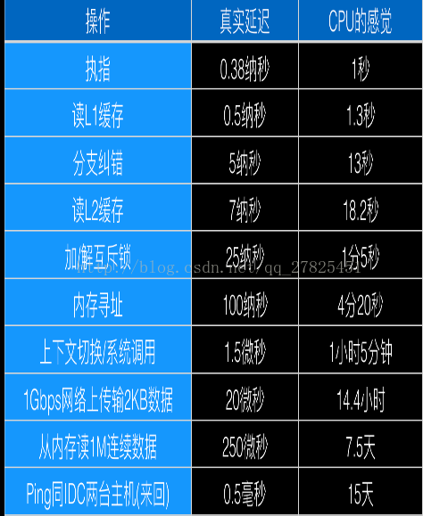

#GoLang

[TOC]

## 0、并发并行

​	很多人不是特别明白并发编程和并行编程的区别所在，有很多人很容易搞混淆，觉得二者近似相等，本文将用几个浅显易懂的例子，来说明一下什么是并发和并行。

### 1、任务与多任务

​       关于什么是进程，什么是线程，这里不打算多说，关于每一种开发语言的多线程处理技术语法上有所区别，原理很多类似，可以查阅相关的参考书。什么是任务呢？其实很简单，在我们生活中，比如我今天要学一首歌，要在操场上散步1000米，然后还要向老师电话汇报研究成果，这是今天的三个任务。在编程语言中，实现某一个任务的一般单元就是“函数”。

### 2、顺序执行

​      上面三个任务，如果在一般的单线程执行的程序里面，分别定义三个函数，然后依次顺序执行，即执行完第一个在执行第二个，然后执行第三个，即我先把一首歌学会，然后在操场上散步1000米，然后再给老师汇报，这样做效率低下。我们可以有一个更加高效的办事方法，我在散步的时候，顺便打电话给老说汇报一下今天的成果，然后边散步边听歌，便跟着学，这样效果就高很多，这里的是“并行执行”。

### 3、并发(concurrency)和并行(parallelism)

​      并发和并行都是完成多任务更加有效率的方式，但还是有一些区别的，并发（concurrency）,并行（parallelism）,可见他们的确是有区别的。下面通过一些具体的例子进行说明。

​      例子一：

​          假设一个有三个学生需要辅导作业，帮每个学生辅导完作业是一个任务
            顺序执行：老师甲先帮学生A辅导，辅导完之后再取给B辅导，最后再去给C辅导，效率低下 ，很久才完成三个任务
            并发：老师甲先给学生A去讲思路，A听懂了自己书写过程并且检查，而甲老师在这期间直接去给B讲思路，讲完思路再去给C讲思路，让B自己整理步骤。这样老师就没有空                         着，一直在做事情，很快就完成了三个任务。与顺序执行不同的是，顺序执行，老师讲完思路之后学生在写步骤，这在这期间，老师是完全空着的，没做事的，所以效率低下。
            并行：直接让三个老师甲、乙、丙三个老师“同时”给三个学生辅导作业，也完成的很快。

​      例子二：

> 顺序执行：你吃饭吃到一半，电话来了，你一直到吃完了以后才去接，这就说明你不支持并发也不支持并行。
> 并发：你吃饭吃到一半，电话来了，你停了下来接了电话，接完后继续吃饭，这说明你支持并发。
> 并行：你吃饭吃到一半，电话来了，你一边打电话一边吃饭，这说明你支持并行

理解：

解释一：并行是指两个或者多个事件在同一时刻发生；而并发是指两个或多个事件在同一时间间隔发生。
解释二：并行是在不同实体上的多个事件，并发是在同一实体上的多个事件。
解释三：在一台处理器上“同时”处理多个任务，在多台处理器上同时处理多个任务。如hadoop分布式集群

普通解释：
并发：交替做不同事情的能力
并行：同时做不同事情的能力
专业术语：
并发：不同的代码块交替执行
并行：不同的代码块同时执行

并发和并行的意义：

并发和并行都可以处理“多任务”，二者的主要区别在于是否是“同时进行”多个的任务。

但是 涉及到任务分解（有先后依赖的任务就不能做到并行）、任务运行（可能要考虑互斥、锁、共享等）、结果合并

### 4、CPU的时间观

​        为什么要进行“并发、并行、多任务、多线程、异步”等等相关的一些操作，就是为了充分利用CPU的巨大潜能，因为很多任务是需要时间的，比如文件的读写、网络数据流的下载等等，如果让CPU处于一个闲置状态，不充分利用它，程序的效率就很低。

​       站在CPU的角度而言，我就是全心全意搞计算的，你却让我闲着没事干，在我的心里，等待的时间就异常漫长。下面是CPU所谓的时间观：

​       

由此可见，站在人类的角度而言，重启一次也就等了5分钟，还可以接受，可是对于CPU而言，它却感觉等了25000年，这是多么漫长的等待，25000年不做事情，太煎熬了。

> Concurrency is when two tasks can start, run, and complete in overlapping time periods. Parallelism is when tasks literally run at the same time, eg. on a multi-core processor.
> Concurrency is the composition of independently executing processes, while parallelism is the simultaneous execution of (possibly related) computations.
> Concurrency is about dealing with lots of things at once. Parallelism is about doing lots of things at once.
> An application can be concurrent – but not parallel, which means that it processes more than one task at the same time, but no two tasks are executing at same time instant.
> An application can be parallel – but not concurrent, which means that it processes multiple sub-tasks of a task in multi-core CPU at same time.
> An application can be neither parallel – nor concurrent, which means that it processes all tasks one at a time, sequentially.
> An application can be both parallel – and concurrent, which means that it processes multiple tasks concurrently in multi-core CPU at same time.
> Vipin Jain. [Differences between concurrency vs. parallelism](https://stackoverflow.com/questions/4844637/what-is-the-difference-between-concurrency-parallelism-and-asynchronous-methods)

翻译成中文：

> 并发是两个任务可以在重叠的时间段内启动，运行和完成。并行是任务在同一时间运行，例如，在多核处理器上。
> 并发是独立执行过程的组合，而并行是同时执行（可能相关的）计算。
> 并发是一次处理很多事情，并行是同时做很多事情。
> 应用程序可以是并发的，但不是并行的，这意味着它可以同时处理多个任务，但是没有两个任务在同一时刻执行。
> 应用程序可以是并行的，但不是并发的，这意味着它同时处理多核CPU中的任务的多个子任务。
> 一个应用程序可以即不是并行的，也不是并发的，这意味着它一次一个地处理所有任务。
> 应用程序可以即是并行的也是并发的，这意味着它同时在多核CPU中同时处理多个任务。

### 5、协程Coroutine及其实现 

​	线程是内核对外提供的服务，应用程序可以通过系统调用让内核启动线程，由内核来负责线程调度和切换。线程在等待IO操作时线程变为unrunnable状态会触发上下文切换。现代操作系统一般都采用抢占式调度，上下文切换一般发生在时钟中断和系统调用返回前，调度器计算当前线程的时间片，如果需要切换就从运行队列中选出一个目标线程，保存当前线程的环境，并且恢复目标线程的运行环境，最典型的就是切换ESP指向目标线程内核堆栈，将EIP指向目标线程上次被调度出时的指令地址。

​	协程也叫用户态线程，协程之间的切换发生在用户态。在用户态没有时钟中断，系统调用等机制，那么协程切换由什么触发？调度器将控制权交给某个协程后，控制权什么时候回到调度器，从而调度另外一个协程运行？ 实际上，这需要协程主动放弃CPU，控制权回到调度器，从而调度另外一个协程运行。所谓协作式线程(cooperative)，需要协程之间互相协作，不需要使用CPU时将CPU主动让出。

​	协程切换和内核线程的上下文切换相同，也需要有机制来保存当前上下文，恢复目标上下文。在POSIX系统上，getcontext/makecontext/swapcontext等可以用来做这件事。

​	协程带来的最大的好处就是可以用同步的方式来写异步的程序。比如协程A，B：A是工作协程，B是网络IO协程(这种模型下，实际工作协程会比网络IO协程多)，A发送一个包时只需要将包push到A和B之间的一个channel，然后就可以主动放弃CPU，让出CPU给其它协程运行，B从channel中pop出将要发送的包，接收到包响应后，将结果放到A能拿到的地方，然后将A标识为ready状态，放入可运行队列等待调度，A下次被调度器调度就可以拿到结果继续做后面的事情。如果是基于线程的模型，A和B都是线程，通常基于回调的方式，1. A阻塞在某个队列Q上，B接受到响应包回调A传给B的回调函数f，回调函数f将响应包push到Q中，A可以取到响应包继续干活，如果阻塞基于cond等机制，则会被OS调度出去，如果忙等，则耗费CPU。2. A可以不阻塞在Q上，而是继续做别的事情，可以定期过来取结果。 这种情况下，线程模型业务逻辑其实被打乱了，发包和取包响应的过程被隔离开了。

​	实现协程库的基本思路很简单，每个线程一个调度器，就是一个循环，不断的从可运行队列中取出协程，并且利用swapcontext恢复协程的上下文从而继续执行协程。当一个协程放弃CPU时，通过swapcontext恢复调度器上下文从而将控制权归还给调度器，调度器从可运行队列选择下一个协程。每个协程初始化通过getcontext和makecontext，需要的栈空间从堆上分配即可。

​	以下分析一个简单的协程库[libtask](http://swtch.com/libtask/)，由golang team成员之一的Russ cox在加入golang team之前开发。只支持单线程，简单包装了一下read/write等同步IO。

 	在libtask中，一个协程用一个struct Task来表示：

## 1、GoLang优势(advantage)

## 