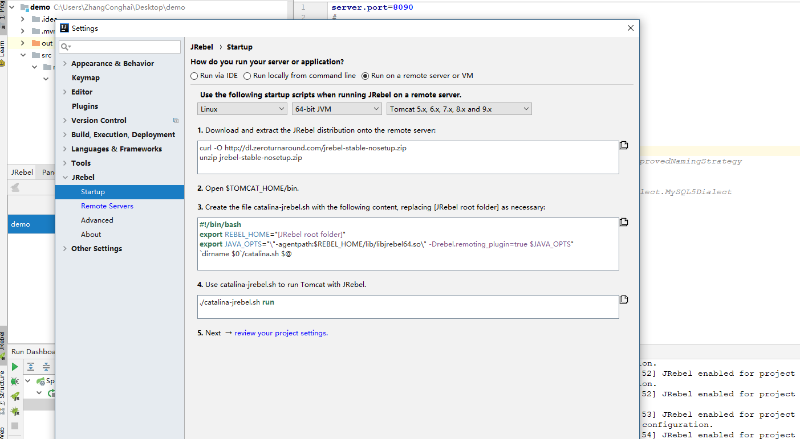

# JRebel remote server support in IntelliJ IDEA

This chapter lists the steps required to set up **JRebel remote server support** for **IntelliJ IDEA**. You need a working, activated JRebel installation in your IDE. Please follow the instructions on how to [install and configure JRebel for IntelliJ IDEA](http://zeroturnaround.com/software/jrebel/quickstart/intellij/). If you have already set up JRebel, move on to step 1.


## 1. Enable JRebel remote server support on the server

Running JRebel on a remote server requires the JRebel agent and a special launch parameter. Follow these steps to do this.

1. Open **Settings > JRebel > Startup**.
2. Select **Run on a remote server**.
3. Use the drop-down menus to specify your remote server configuration.
4. Follow the instructions displayed.




### How do I know this works?

Once you have successfully configured JRebel remote server support for your remote server, you should see the following banner during remote server startup:

```
JRebel:  #####################################################
JRebel:
JRebel:  JRebel Legacy Agent 7.0.6
JRebel:  (c) Copyright ZeroTurnaround AS, Estonia, Tartu.
JRebel:
JRebel:  Over the last 1 days JRebel prevented
JRebel:  at least 1 redeploys/restarts saving you
JRebel:  about 0 hours.
JRebel:
JRebel:  Server is running with JRebel remote server support.
JRebel:
JRebel:  #####################################################
```


## 2. Add a remote server to IntelliJ IDEA

1. Open **Settings > JRebel > Remote servers**. You will be presented with the following view:

   

2. Press **+** to configure a new remote server. The following dialog will open:


   Provide the required remote server information:

   - **Server URL** – Provide the full URL for the server. This field is required.

   You can specify optional information and configure security settings for the remote server:

   - **Server name** – Give your server a recognizable title. This will be used to refer to this server in other JRebel dialogs.
   - **Server authentication** – Enable additional synchronization security. Specify a simple alphanumeric password. The password also needs to be set on the server: `java -jar jrebel.jar -set-remote-password <NewPassword>`
   - **HTTP Basic authentication** – Enable HTTP authentication when your remote server requires it.

   Tip

   Press **Test Connection** to immediately test the server URL. This test will ping the server for JRebel, verifying its presence and correct version.

3. Press **OK** to store the new remote server.

This server can now be used by all modules in IntelliJ IDEA. Note that multiple remote servers can be added and used simultaneously. Deselecting an existing remote server in the **Remote servers** view will exclude it from synchronization.

Note

Select **Synchronize on build** in **Settings > JRebel > Remote servers** to automatically synchronize changes with remote servers when compiling.


## 3.Configure modules for remote server support

1. Open **View > Tool Windows > JRebel**. The **JRebel Modules** view is opened in IntelliJ IDEA:

2. Select the  checkbox for your desired modules.

   Note

   The configuration file `rebel-remote.xml` is created in the project resources folder.

3. Build and redeploy your application containing the `rebel-remote.xml` configuration file to the remote server.

4. You are set!

Tip

By default, all configured projects inherit the workspace server settings.

To configure your workspace projects for a customized remote server setup, press the pencil icon next to the project name. The project properties window is opened for remote servers. The following options are available:

- **Off** – No remote server synchronization functionality is applied to the project.
- **Use workspace servers** – Once remote servers have been defined and enabled via **Help > JRebel > Configuration > Remote servers**, all of them will be used for synchronization of this project. This option provides a simpler configuration when working with just one remote server or when the project is deployed to all remote servers. You can use the global **Remote servers** view to enable/disable servers for all projects configured with this option.
- **Select specific workspace servers for this project** – Select or deselect remote servers in the table to enable them for the project. This project will be synchronized only with the selected servers. Note that enabling or disabling remote servers in the global **Remote servers** view has no effect on projects using this configuration.

As of **JRebel 6.4.8**, any previous project-specific settings will be automatically converted to configurable workspace servers.


## 4. Synchronize with the server

Use the  synchronization button on the **JRebel Modules** tool window to manually synchronize your workstation and remote servers.