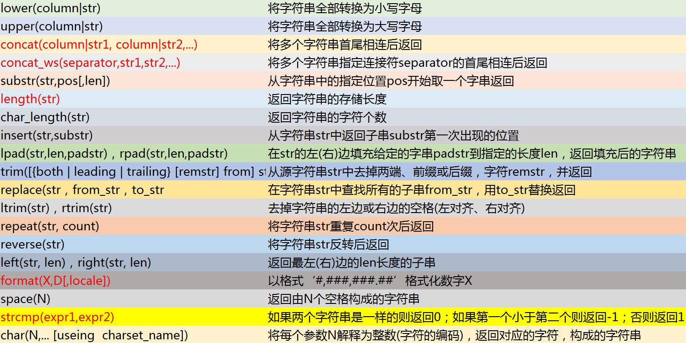

# MySQL

[TOC]


##字符串处理函数

 


## 时区问题

> 在使用mysql的6.0.x以上的jar的时候，需要在代码url的链接里面指定serverTimezone。就会出现异常

### 1.未指定serverTimezone

- xml里面配置url

```
<property name="url" value="jdbc:mysql://localhost:3306/mybatisstudy"/>
```

- 出现的异常

```
Caused by: com.mysql.cj.core.exceptions.InvalidConnectionAttributeException: The server time zone value '�й���׼ʱ��' is unrecognized or represents more than one time zone. You must configure either the server or JDBC driver (via the serverTimezone configuration property) to use a more specifc time zone value if you want to utilize time zone support.
```

> 您必须配置服务器或JDBC驱动程序(通过serverTimezone配置属性)，如果您想要使用时区支持，则需要使用一个更详细的时区值。

### 2.网上的解决方案

- 在url后面加上参数?serverTimezone=utc

```
<property name="url" value="jdbc:mysql://localhost:3306/springdatastudy?serverTimezone=UTC"/>
```

#### 2.1.遇到的问题

> 虽然上面加上时区程序不出错了，但是我们在用java代码插入到数据库时间的时候却出现了问题。

```
比如在java代码里面插入的时间为：2017-08-21 17:29:56

但是在数据库里面显示的时间却为：2017-08-21 09:29:56
```

### 3.根本原因

> 因为时区设置的问题。

> UTC代表的是全球标准时间 ，但是我们使用的时间是北京时区也就是东八区，领先UTC八个小时。

> UTC + (＋0800) = 本地（北京）时间

### 4.解决方案

> url的时区使用中国标准时间。也是就serverTimezone=Asia/Shanghai

#### 4.1 使用java代码获取本地的时区id

```
Calendar cal = Calendar.getInstance();
TimeZone timeZone = cal.getTimeZone();
System.out.println(timeZone.getID());
System.out.println(timeZone.getDisplayName());
Asia/Shanghai
中国标准时间
```

### 5.中文乱码的解决方案

> url链接后面加上编码字符 characterEncoding=utf8

```
jdbc.url=jdbc:mysql://localhost:3306/cnblogs?serverTimezone=Asia/Shanghai&characterEncoding=utf8
```

如果您觉得此文有帮助，可以赞赏以支持下，写出更好的文章！

作者：落叶飞逝的恋

链接：https://www.jianshu.com/p/7e9247c0b81a


