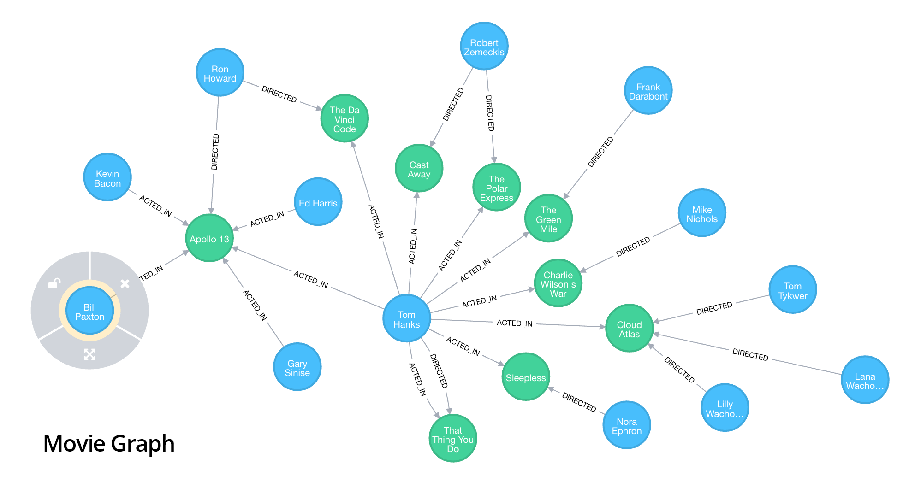

# neo4j

[TOC]

## abstract

neo4j is a high performance **node-based graph** database

## install

in order to install the neo4j

1. installl the jdk
2. download the tar from [neo4j website](https://neo4j.com/download-thanks/?edition=community&release=3.5.1&flavour=unix&_ga=2.252676929.934612670.1547880180-280554193.1546780062)
3. tar -zvxf *.tar
4. modify the conf/neo4j.properties and allow 0.0.0.0 for access **or other settings**
5. To run Neo4j as a console application, use:
   `<NEO4J_HOME>/bin/neo4j console`
6. To run Neo4j in a background process, use:
   `<NEO4J_HOME>/bin/neo4j start`
7. access using web manager [ip:port](http://<IP>:7474)

> If aliyun is used remember to open the port in the aliyun console 
>
> Default login is **username 'neo4j'** and **password 'neo4j'**

