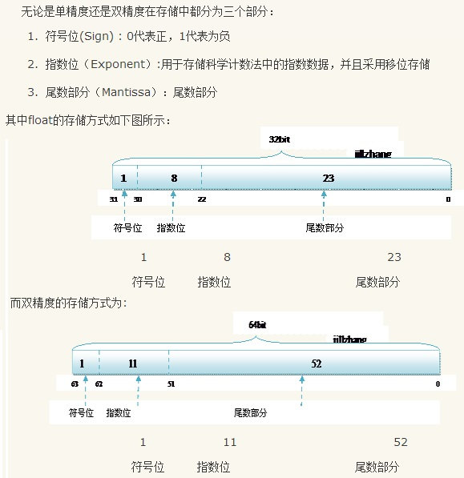
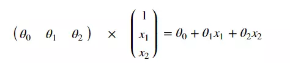
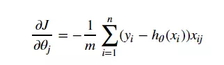

# Python 的基本数据类型

## 1、整数

Python 可以处理任意大小的整数（内存足够的情况下），包括负整数

## 2、浮点数

与C类语言一致

> Floating point numbers are usually implemented using double in C



## 3、字符串

字符串是以 '' 或 "" 括起来的任意文本，比如 `'abc'` ，`"123"` 

### （1） Python 中的字符串和字符串转义

```
\n 表示换行
\t 表示一个制表符
\\ 表示 \ 字符本身
```

如果要表示多行字符串，可以用`'''...'''`表示,当然你也还可以在多行字符串前面添加 `r` ，把这个多行字符串也变成一个raw字符串


### （2） 字符串的编码问题

Python 在后来添加了对 Unicode 的支持，以 Unicode 表示的字符串用`u'...'`表示。

不过在最新的 Python 3 版本中，字符串是以 Unicode 编码的，也就是说，Python 的字符串支持多语言。就像上面的例子一样，我的代码中没有加`u'...'`，也能正常显示。

不过由于 Python 源代码也是一个文本文件，所以，当你的源代码中包含中文的时候，在保存源代码时，就需要务必指定保存为 UTF-8 编码。当Python 解释器读取源代码时，为了让它按 UTF-8 编码读取，我们通常在文件开头写上这两行：

```
#!/usr/bin/env python3
# -*- coding: utf-8 -*-
```

第一行注释是为了告诉 Linux/OS X 系统，这是一个 Python 可执行程序，Windows 系统会忽略这个注释；

第二行注释是为了告诉 Python 解释器，按照 UTF-8 编码读取源代码，否则，你在源代码中写的中文输出可能会有乱码。

申明了 UTF-8 编码并不意味着你的 .py 文件就是 UTF-8 编码的，必须并且要确保文本编辑器正在使用 UTF-8 without BOM 编码

## 4、布尔值

布尔值和布尔代数的表示完全一致，一个布尔值只有 `True` 、 `False `两种值，要么是 `True`，要么是 `False`，在 Python 中，可以直接用 True、False 表示布尔值（请注意大小写），也可以通过布尔运算计算出来。

布尔值可以用 `and`、`or` 和 `not` 运算。

## 5、空值

基本上每种编程语言都有自己的特殊值——空值，在 Python 中，用 None 来表示


# Numpy操作

#### 创建矩阵

```python
#创建一维的narray对象
a = np.array([1,2,3,4,5])
#创建二维的narray对象
a2 = np.array([[1,2,3,4,5],[6,7,8,9,10]])

# arrange
a = np.arange(10) # 默认从0开始到10（不包括10），步长为1
print(a) # 返回 [0 1 2 3 4 5 6 7 8 9]
a1 = np.arange(5,10) # 从5开始到10（不包括10），步长为1
print(a1) # 返回 [5 6 7 8 9]
a2 = np.arange(5,20,2) # 从5开始到20（不包括20），步长为2
print(a2) # 返回 [ 5  7  9 11 13 15 17 19]

np.ones(1,6) #zeros,eye创建单位矩阵 empty创建空矩阵（实际有值）
np.eye(6)
array([[1., 0., 0., 0., 0., 0.],
       [0., 1., 0., 0., 0., 0.],
       [0., 0., 1., 0., 0., 0.],
       [0., 0., 0., 1., 0., 0.],
       [0., 0., 0., 0., 1., 0.],
       [0., 0., 0., 0., 0., 1.]])

```

#### Numpy数学运算
|函数|说明|
|  ------------  |   -----------------------------------    |
| `np.sin(a)` | `对矩阵a中每个元素取正弦,sin(x)` |
| `np.cos(a)`  | `对矩阵a中每个元素取余弦,cos(x)`    |
| `np.tan(a)`  | `对矩阵a中每个元素取正切,tan(x)`    |
| `np.arcsin(a)` | `对矩阵a中每个元素取反正弦,arcsin(x)` |
| `np.arccos(a)` | `对矩阵a中每个元素取反余弦,arccos(x)` |
| `np.arctan(a)` | `对矩阵a中每个元素取反正切,arctan(x)` |
| `np.exp(a)`  | `对矩阵a中每个元素取指数函数,ex`    |
| `np.sqrt(a)` | `对矩阵a中每个元素开根号√x`         |

#### Numpy求逆

```python
import numpy.linalg as lg
a = np.array([[1,2,3],[4,5,6],[7,8,9]])
print(lg.inv(a))# 结果
[[ -4.50359963e+15   9.00719925e+15  -4.50359963e+15]
 [  9.00719925e+15  -1.80143985e+16   9.00719925e+15]
 [ -4.50359963e+15   9.00719925e+15  -4.50359963e+15]]
```

#### Numpy统计信息

| 函数                      | 含义                                                         |
| ------------------------- | ------------------------------------------------------------ |
| `array.mean(axis=0)`      | 行方向的平均值，同样，0,1代表维度                            |
| `array.var(axis=0)`       | 方差函数`var()`相当于函数`mean(abs(x - x.mean())**2)`,其中x为矩阵 |
| `np.median(array,axis=0)` | 中位数                                                       |
| `array.sum(axis=0)`       | 求和                                                         |

#### Numpy矩阵的截取

##### 切片

```python
a[row,col] #截取第几行（：）以及第几列的元素
```

##### 按条件切片

```python
a = np.array([[1,2,3,4,5],[6,7,8,9,10]])
b = a[a>6] # 截取矩阵a中大于6的元素，范围的是一维数组
print(b) # 返回 [ 7  8  9 10]
# 应用场景 可以快速将数组内按照条件清洗
a[a>6]=0
#大于6清零后矩阵为
[[1 2 3 4 5]
 [6 0 0 0 0]]
```

##### clip截取

```python
array=np.array([[1,2,3],
                [4,5,6]])
print(array.clip(2,4))
# 将越界部分全部裁去 结果
# [[2 2 3]
#  [4 4 4]]
```

#### Numpy.random函数集合

```python
# 随机函数
numpy.random.rand(dim1,dim2...) #dim1 dim2 为维度数
# 正态分布
numpy.random.randn(dim1,dim2...) #dim1 dim2 为维度数
# 返回随机整数，范围区间为[low,high），size=[dim1,dim2]
numpy.random.randint(low, high=None, size=None, dtype=’l’)
```

### 矩阵操作

```python
# 矩阵转置
W.T #重要
# 矩阵点乘
np.dot(X,W.T)
# 矩阵合并 将两个矩阵按照x方向合并,在axis维度上必须等长
np.concatenate( (a1,a2), axis=0 )  # 等价于  np.vstack( (a1,a2) )
np.concatenate( (a1,a2), axis=1 )  # 等价于  np.hstack( (a1,a2) ) 
```


# Python实现逻辑回归

### 建立sigmoid函数

```python
def sigmoid(z):
    return 1 / (1 + np.exp(-z))
```

### 建立求解映射

```python
def model(X, W): # 预测函数
    return sigmoid(np.dot(X, W.T)) # 矩阵的乘法
```



### 交叉熵损失函数

```python
def cost(X, y, W):
    left = np.multiply(-y, np.log(model(X, W)))
    right = np.multiply(1 - y, np.log(1 - model(X, W)))
    return np.sum(left - right) / (len(X))
```


### 计算梯度



```python
def gradient(X, y, theta):
    grad = np.zeros(theta.shape) # 有几个theta就有几个梯度
    error = (model(X, theta)- y).ravel() #revel 将n维展成一维
    for j in range(len(theta.ravel())): # for each parmeter
        term = np.multiply(error, X[:,j]) # 将对应的输入乘以输出
        grad[0, j] = np.sum(term) / len(X) # 梯度除以n
    
    return grad
```

### 训练

```python
#梯度下降求解训练 data(数据) W(初始W) times(总迭代数) alpha(学习率)
def descent(data, W, times, alpha): 
    #梯度下降求解
    i = 0 # 迭代次数
    # 将data 洗乱
    X, y = shuffleData(data)
    grad = np.zeros(W.shape) # 计算的梯度
    costs = [cost(X, y, W)] # 损失值
    while True:
        if i>=times:
            break
        i+=1;
        # 计算梯度
        grad = gradient(X, y, W)
        # 更新W权值
        W=W-alpha*grad
        # 记录训练损失
        costs.append(cost(X,y,W))
    return costs,W #返回训练损失记录以及权值矩阵
    
```


# Envs

### 1 更改主题和字体

`pip install --upgrade jupyterthemes`
`jt -l` 查看有哪些主题
`jt -f inconsolata -t onedork` 更改喜欢的字体和主题，-f 表示字体，-t 表示主题，这里是我认为好看的主题和字体。建议尝试。

`jt -r` 恢复默认主题


### 2 远程访问设置

#### 2.1 生成一个 `notebook` 配置文件

默认情况下，配置文件 `~/.jupyter/jupyter_notebook_config.py` 并不存在，需要自行创建。使用下列命令生成配置文件：
`jupyter notebook --generate-config`

#### 2.2 生成密码

打开 `ipython` 执行下面内容：

```python
In [1]: from notebook.auth import passwd
In [2]: passwd()
Enter password:
Verify password:
Out[2]: 'sha1:67c9e60bb8b6:9ffede0825894254b2e042ea597d771089e11aed'
```

`sha1:67c9e60bb8b6:9ffede0825894254b2e042ea597d771089e11aed`这一串就是要在 `jupyter_notebook_config.py` 添加的密码。

#### 2.3 修改配置文件

在 `jupyter_notebook_config.py` 中找到下面的行，取消注释并修改。

```python
c.NotebookApp.ip='*'
c.NotebookApp.password = u'sha:ce...刚才复制的那个密文'
c.NotebookApp.open_browser = False
c.NotebookApp.port =8888 #可自行指定一个端口, 访问时使用该端口
c.NotebookApp.allow_root = True
```

以上设置完以后就可以在服务器上启动 `jupyter notebook`，`jupyter notebook`, `root` 用户使用 `jupyter notebook --allow-root`。打开 IP:指定的端口, 输入密码就可以访问了。