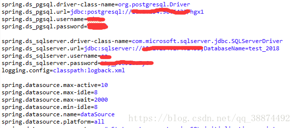

# Spring

## 基本概念

Spring 用于简化开发，帮助降低`Java`开发的复杂性——采用四种关键策略

1. 基于POJO的轻量级和最小侵入性编程
2. 通过依赖注入和面向接口实现松耦合
3. 基于切面和惯例实现声明式编程
4. 通过切面和模板减少样板式代码

**POJO** 

简单类，采用非侵入式的设计，在设计简单类的同时不留痕迹的完成bean的生成最坏的情况下，可能需要使用Spring 注解。

### **依赖注入** 

对于面向对象的编程语言而言，任何一个有实际意义的应用，起码都应该由两个或者更多的类组成，这些类通过相互写作完成特定的业务逻辑例如MVC，传统的做法是`每个对象负责管理和自己相互协作的对象的引用`，这将会导致高度的耦合以及难以测试。

传统例如：创建一个`救援骑士`类继承`骑士`类，要实现一个`援救公主`的请求，就需要在类内创建一个`援救公主`的实体对象。由`救援骑士`类负责管理这个对象，拓展开来，例如`救援骑士`在结束`援救公主`这一个实体之后，还需要进行`与恶龙战斗`这样的任务，需要重新建立实体对象，如果任务较多复杂的话，管理的对象也随之增加，同时例如对于`拔剑`这样的动作可以重复利用的情况下，需要保证所有的实体对象都具有这样的方法，存在耦合上的问题。同时由于紧耦合，耦合成一个整体，所以对于外部调试以及编写测试类，存在较多的问题。

依赖注入会将所依赖的关系自动转交给对象，例如创建`救援骑士`类实体的时候将引用`援救请求`接口的`援救公主`或者`援救王子`类似的对象直接传入，之后由于接口的特性能够保证接口的可调用性。同时能够保证的是`救援骑士`类没有与任何的实体类发生耦合

将这两个简单类组合在一起需要使用装配`wire`，相当于将豆片组合成一个完整的咖啡果。可以使用XML来配置Spring的装配，也可以创建Java描述配置@Configuration以及@Bean**相当于创建一个配置类，类内是函数，函数的返回值是具体的类实例**

```java
@Configuration
public class KnightConfig{
    @Bean
    public Knight knight(){
        return new BraveKnight(quest());
    }
    @Bean
    public Quest quest(){
        return new SlayDragonQuest(System.out);
    }
}
```

Spring 中如果使用XML文件进行Bean装配的话，需要配合使用`ClassPathXmlApplicationContext("META-INF/spring/knights.xml")`加载XML文件。

### **应用切面**

依赖注入能够使相互协作的组件保持松散耦合，面向切面编程AOP能够使你把遍布应用各处的功能分离出来形成可重用的组件

切面的思想可以从MVC中体现，其中Model层，View层，Controller层都是一种大的切面，内部可以包含更多的小切面，例如Service层中的事务管理层可以包括学生服务，老师服务，课程服务，计费服务等，另外可以包含日志层，安全模块层等等，这些层级之间可以相互连接

 

 

 

例如想要在上面的`救援骑士`的类中加入`吟游诗人`类负责记录救援过程，常规的思路是在救援骑士类中加入一个吟游诗人类，通过调用`吟游诗人`类中的方法记录救援过程，但是如果以后出现一个不需要`吟游诗人`的`救援骑士`对象便出现问题了。

采用AOP切面注入的方式能够将吟游诗人

```xml
<aop:config>
    <aop:aspect ref="minstrel">
        <aop:pointcut id="embark" expression="excution(* *.embarkOnQuest(..))"/>
        <aop:before pointcut-ref="embark" method="singBeforeQuest"/>
        <aop:after pointcut-ref="embark" method="singAfterQuest"/>
    </aop:aspect>
</aop:config>            
```

切面可以前置通知或者后置通知，在切入点前后插入内容、语言类型是**AspectJ**

### 模板样式

许多关于java的API拥有各种类似于样板式的代码，其中包含了大量的重复劳动，在`java 5`之后的版本中加入了部分`template`模板；例如`java`的`JdbcTemplate`以及`JMS`、`JNDI`、以及`REST`服务。模板类会对Exception进行控制

## 核心 Core

### 控制反转IoC(Inverse of Control)

### 切面编程AOP(aspect-oriented programing)

## Bean容器

在基于spring的应用中，将会把所有的应用对象生成与spring容器（container）中，

### 上下文


##注解

###@RequestMapping(value = "",method = RequestMethod.POST)   

method包含

* POST
* GET
* PUT
* DELETE
* http://localhost:8080/User?_method=get&id=1001 通过get请求获取数据库 user表 id=1001 的用户信息  
* http://localhost:8080/User?_method=post&id=1001&name=zhangsan向数据库user 表里面插入一条记录  
* http://localhost:8080/User?_method=put&id=1001&name=lisi 将 user表里面 id=1001 的用户名改为lisi  
* http://localhost:8080/User?_method=delete&id=1001 将数据库user 表里面的id=1001 的信息删除 


## RESTful 架构

	从上面的定义中，我们可以发现REST其实是一种组织Web服务的架构，而并不是我们想象的那样是实现Web服务的一种新的技术，更没有要求一定要使用HTTP。其目标是为了创建具有良好扩展性的分布式系统。

　　反过来，作为一种架构，其提出了一系列架构级约束。这些约束有：

1. 使用客户/服务器模型。客户和服务器之间通过一个统一的接口来互相通讯。
2. 层次化的系统。在一个REST系统中，客户端并不会固定地与一个服务器打交道。
3. 无状态。在一个REST系统中，服务端并不会保存有关客户的任何状态。也就是说，客户端自身负责用户状态的维持，并在每次发送请求时都需要提供足够的信息。
4. 可缓存。REST系统需要能够恰当地缓存请求，以尽量减少服务端和客户端之间的信息传输，以提高性能。
5. 统一的接口。一个REST系统需要使用一个统一的接口来完成子系统之间以及服务与用户之间的交互。这使得REST系统中的各个子系统可以独自完成演化。


## 处理异常

将异常转换为响应

* 特定的Spring异常将会自动映射为指定的HTTP状态码
* 异常上添加@ResponseStatus注解，将其映射为HTTP状态码


# MYBATIS

1. 如何初始化连接池

在openSession的时候，mybatis才会new第一个连接，并放入连接池。

2. mybatis是如何返回一个连接的，先上代码

2.1.首先判断是否存在空闲的连接，存在则返回一个空闲的连接（mybatis用了很多if else，感觉可读性不是很好）。
2.2.接着判断连接数是否小于最大连接数，小于则new一个新的连接返回 。
2.3.首先得到一个非空闲时间最长的连接，判断该连接用了多久，如果超过了一个连接的最大使用时间，则返回这个连接.
2.4 上面的都不成立，就等待一个时间（默认为poolTimeToWait=20000），然后继续上面的判断。

3. mybatis是如何将一个连接放回连接池的

是通过**动态代理**的方式，每次调用**PooledConnection**的时候，就会判断方法名是否为：close，如果是就将连接放入连接池。

4. mybatis会在程序结束的时候释放连接池里面的连接吗

不会的，不过还好并发数不搞的时候创建的连接很少。
如果做高并发的测试，那就要小心数据库爆掉..

http://www.xuebuyuan.com/1487139.html


# Springboot

## 启动原理

我们知道，如果不需要特殊的配置，只需要在main方法里调用SpringApplicatio.run（）方法即可启动Spring Boot应用：

```java
public static void main(String[] args) throws Exception {
SpringApplication.run(Application.class, args);
}
```


作为深入原理的第一篇，我们先来看下Spring Boot应用是怎么启动的。SpringApplication启动流程SpringApplication的启动过程非常复杂，下面是在调用SpringApplication.run方法之后启动的关键动作：既然要了解SpringApplication的启动流程，第一步当然是进入源码里看看喽：

```java
public ConfigurableApplicationContext run(String... args) {
StopWatch stopWatch = new StopWatch();
stopWatch.start();
ConfigurableApplicationContext context = null;
FailureAnalyzers analyzers = null;
configureHeadlessProperty();
//初始化监听器
SpringApplicationRunListeners listeners = getRunListeners(args);
//发布ApplicationStartedEvent
listeners.starting();
try {
//装配参数和环境
ApplicationArguments applicationArguments = new DefaultApplicationArguments(args);
ConfigurableEnvironment environment = prepareEnvironment(listeners,applicationArguments);
//打印Banner
Banner printedBanner = printBanner(environment);
//创建ApplicationContext()
context = createApplicationContext();
analyzers = new FailureAnalyzers(context);
//装配Context
prepareContext(context, environment, listeners, applicationArguments,printedBanner);
//refreshContext
refreshContext(context);
//afterRefresh
afterRefresh(context, applicationArguments);
//发布ApplicationReadyEvent
listeners.finished(context, null);
stopWatch.stop();
if (this.logStartupInfo) {
new StartupInfoLogger(this.mainApplicationClass).logStarted(getApplicationLog(), stopWatch);
}
return context;
}
catch (Throwable ex) {
handleRunFailure(context, listeners, analyzers, ex);
throw new IllegalStateException(ex);
}
}
```

### 第一步，初始化监听器

这里会初始化Spring Boot自带的监听器，以及添加到SpringApplication的自定义监听器。

初始化监听器的调用关系很深，为了节省篇幅，就不贴源码了，稍后用专门的文章细聊。

### 第二步，发布ApplicationStartedEvent事件

到这一步，Spring Boot会发布一个ApplicationStartedEvent事件。如果你想在这个时候执行一些代码可以通过实现ApplicationListener接口实现；

下面是ApplicationListener接口的定义，注意这里有个`<E extends ApplicationEvent>`

`public interface ApplicationListener<E extends ApplicationEvent> extends EventListener`

例如，你想监听ApplicationStartedEvent事件，你可以这样定义：

> public class ApplicationStartedListener implements ApplicationListener`<ApplicationStartedEvent>`

然后通过SpringApplication.addListener(..)添加进去即可。

### 第三步，装配参数和环境

在这一步，首先会初始化参数，然后装配环境，确定是web环境还是非web环境。

### 第四步，发布ApplicationEnvironmentPreparedEvent事件

准确的说，这个应该属于第三步，在装配完环境后，就触发ApplicationEnvironmentPreparedEvent事件。如果想在这个时候执行一些代码，可以订阅这个事件的监听器，方法同第二步。

### 第五步，打印Banner

看过[Spring Boot实例教程 - 自定义Banner](http://majunwei.com/view/201708171646079868.html)的同学会很熟悉，启动的Banner就是在这一步打印出来的。

### 第六步，创建ApplicationContext

这里会根据是否是web环境，来决定创建什么类型的ApplicationContext,ApplicationContext不要多说了吧，不知道ApplicationContext是啥的同学，出门左转补下Spring基础知识吧。

### 第七步，装配Context

这里会设置Context的环境变量、注册Initializers、beanNameGenerator等。

### 第八步，发布ApplicationPreparedEvent事件

这里放在第七步会更准确，因为这个是在装配Context的时候发布的。

值得注意的是：这里是假的，假的，假的，源码中是空的，并没有真正发布ApplicationPreparedEvent事件。不知道作者这么想的？？？

### 第九步，注册、加载等

注册springApplicationArguments、springBootBanner，加载资源等。

### 第十步，发布ApplicationPreparedEvent事件

注意，到这里才是真正发布了ApplicationPreparedEvent事件。这里和第八步好让人误解。

### 第十一步，refreshContext

装配context beanfactory等非常重要的核心组件。

### 第十二步，afterRefreshContext

这里会调用自定义的Runners，不知道Runners是什么的同学，请参考[Spring Boot官方文档 - SpringApplication](http://majunwei.com/view/201708211657187575.html)

### 第十三步，发布ApplicationReadyEvent事件

最后一步，发布ApplicationReadyEvent事件，启动完毕，表示服务已经可以开始正常提供服务了。通常我们这里会监听这个事件来打印一些监控性质的日志，表示应用正常启动了。添加方法同第二步。

注意：如果启动失败，这一步会发布ApplicationFailedEvent事件。

到这里，Spring Boot启动的一些关键动作就介绍完了。

# 总结

说是深入，本篇文章更像是一个概括性的介绍。因为每个关键动作内容都很多，都很值得深入研究，都放在这里显然空间太小，接下来将会分章节深入每个关键动作。

**接口实例**

	@RequestMapping(value = "/getWarningDetail.action", method = RequestMethod.GET)
	@RequiresPermissions(value = {"/Realtimealarm"}) 
	@ResponseBody
	public Object getWarningDetail(String devCode, Integer offset, Integer rows) {
			List<Map> warningRecords = warningService.getAllWarningDetails(devCode);
			Collections.reverse(warningRecords);
			List<Map> returnList = new ArrayList<>();
	
			if (offset == null) {
				offset = 0;
			}
			if (rows == null) {
				rows = warningRecords.size();
			}
			for (int i = 0; i < warningRecords.size(); i++) {
				if (offset <= i && i < offset + rows) {
					returnList.add(warningRecords.get(i));
				}
			}
	
			Map map = new HashMap();
			map.put("total", warningRecords.size());
			map.put("success", 1);
			map.put("rows", returnList);
			return AppUtil.conversionJsonp(map);
		}


## DAO层

### 连接多个数据库

 创建一个springboot项目，在pom.xml文件中导入一些基本的依赖并导入需要连接的两个数据库postgresql,和sqlserver的依赖。在application-dev.properties配置文件中配置两个数据库的连接信息。




    使用@Configuration注解创建一个数据源配置类，在此类上使用@PropertiesSource注解寻找这个数据源配置类关联的数据库连接信息的配置文件的地址（此配置文件可以放在项目外边，便于修改配置文件的连接信息）。在数据源配置类中使用@Bean注解创建两个数据源对象，并使用@ConfigurationProperties注解指定数据源对象关联的数据库连接信息。
    
    

  使用@Configuration注解创建一个pgSqlSessionFactory配置类，使用@MapperScan注解指定扫描mapper的地址，并使用@Autowired注解注入pgSql数据源对象DateSource,使用@Bean注解创建一个slqSessionFactory对象，并设置注入的DateSource属性，使用@Bean注解创建一个sqlSessionFactoryTemplate对象，使用构造方法设置sqlSessionfactory值。


    使用@Configuration注解创建一个sqlServerSessionFactory配置类，使用@MapperScan注解指定扫描mapper的地址，并使用@Autowired注解注入sqlServer数据源对象DateSource,使用@Bean注解创建一个slqSessionFactory对象，并设置注入的DateSource属性，使用@Bean注解创建一个sqlSessionFactoryTemplate对象，使用构造方法设置sqlSessionfactory对象值。


    通过两个配置类对象上面的@MapperScan注解中的地址创建两个包，一个包操作qgsql数据库，另一个操作sqlServer数据库，完成同时对两个数据库的操作


###Mybatis

#### 转义<![CDATA[ ]]>

        如果要求借助 **mybatis** 在XML文件中写出分数小于72分的学生姓名，那么XML文件中相应的SQL语句为：
    
        SELECT `name` FROM  student_score_table <![CDATA[ WHERE score < 72 ]]> 
    
        **而不是**
    
        SELECT `name` FROM  student_score_table WHERE score < 72 

#### XML 文件转义

CDATA全名为character data，指不使用XML解析器解析的文本数据。在标记CDATA下，所有与XML规范冲突的关键字字符串都被XML处理程序一视同仁地当做字符数据看待，CDATA的形式如下：

> <![CDATA[文本内容]]> 
>
> 其中文本内容中不能出现字符串“]]>”，另外CDATA不能嵌套。 
>
> `”]]>”`这部分不能包含空格或者换行 
>
> (1)&　　　`&amp;`  　　
>
> (2)<　　　`&lt;`  　　
>
> (3)>　　　`&gt;`  　　
>
> (4)＂　　　`&quot;`  　　
>
> (5)＇　　　`&apos;`  

 


# Springboot启动

idea的启动方式中默认会自动根据类型创建springboot的启动方式，如果要部署到tomcat上则必须要以新版本的方式配置，**继承Springboot的`SpringBootServletInitializer`初始化器**，具体原因不明，只需要继承初始化器即可，并不`Override`新方法，仍然采用`main`函数即可

```java
旧版本写法
@Configuration
@EnableScheduling
public class Application{
    public static void main(String[] args) throws Exception {
        SpringApplication.run(Application.class, args);
        }
}
```

```java
新版本写法
@Configuration
@EnableAutoConfiguration
public class Application extends SpringBootServletInitializer {   
    @Override
    protected SpringApplicationBuilder configure(SpringApplicationBuilder application) {
        return application.sources(Application.class);
    }
}
```

	在数据层，如果采用`springboot`自带的`JPA`方式的持久层的话，需要在`application.properties`中对数据库的连接做声明，否则的话会在`datasource`的初始化过程中抛出异常。 也可以在入口`SpringbootApplication`注解中采用`exclude=datasource`的方式对数据源的初始化过程进行排除（需要排除的应该不只有`datasouce`一个） 部署的时候war包名称便是`url` 网址后的子菜单页位置，如果默认不加最高母后缀的话，需要**修改war包名称**为`ROOT.war` 只有这样才能将默认的index直接映射到`url`上，tomcat会根据webapps内的文件夹结构创建逻辑


# 注解大全


**注解本身没有功能的，就和xml一样。注解和xml都是一种元数据，元数据即解释数据的数据，这就是所谓配置。**

本文主要罗列Spring|SpringMVC相关注解的简介。

## Spring部分

**1.声明bean的注解**

@Component 组件，没有明确的角色

@Service 在业务逻辑层使用（service层）

@Repository 在数据访问层使用（dao层）

@Controller 在展现层使用，控制器的声明（C）

**2.注入bean的注解**

@Autowired：由Spring提供

@Inject：由JSR-330提供

@Resource：由JSR-250提供

都可以注解在set方法和属性上，推荐注解在属性上（一目了然，少写代码）。

**3.java配置类相关注解**

@Configuration 声明当前类为配置类，相当于xml形式的Spring配置（类上）

@Bean 注解在方法上，声明当前方法的返回值为一个bean，替代xml中的方式（方法上）

@Configuration 声明当前类为配置类，其中内部组合了@Component注解，表明这个类是一个bean（类上）

@ComponentScan 用于对Component进行扫描，相当于xml中的（类上）

@WishlyConfiguration 为@Configuration与@ComponentScan的组合注解，可以替代这两个注解

**4.切面（AOP）相关注解**

Spring支持AspectJ的注解式切面编程。

@Aspect 声明一个切面（类上） 
使用@After、@Before、@Around定义建言（advice），可直接将拦截规则（切点）作为参数。

@After 在方法执行之后执行（方法上） 
@Before 在方法执行之前执行（方法上） 
@Around 在方法执行之前与之后执行（方法上）

@PointCut 声明切点 
在java配置类中使用@EnableAspectJAutoProxy注解开启Spring对AspectJ代理的支持（类上）

**5.@Bean的属性支持**

@Scope 设置Spring容器如何新建Bean实例（方法上，得有@Bean） 
其设置类型包括：

Singleton （单例,一个Spring容器中只有一个bean实例，默认模式）, 
Protetype （每次调用新建一个bean）, 
Request （web项目中，给每个http request新建一个bean）, 
Session （web项目中，给每个http session新建一个bean）, 
GlobalSession（给每一个 global http session新建一个Bean实例）

@StepScope 在Spring Batch中还有涉及

@PostConstruct 由JSR-250提供，在构造函数执行完之后执行，等价于xml配置文件中bean的initMethod

@PreDestory 由JSR-250提供，在Bean销毁之前执行，等价于xml配置文件中bean的destroyMethod

**6.@Value注解**

@Value 为属性注入值（属性上） 
支持如下方式的注入： 
》注入普通字符

```
@Value("Michael Jackson")
String name;12
```

》注入操作系统属性

```
@Value("#{systemProperties['os.name']}")
String osName;12
```

》注入表达式结果

```
@Value("#{ T(java.lang.Math).random() * 100 }")
String randomNumber;12
```

》注入其它bean属性

```
@Value("#{domeClass.name}")
String name;12
```

》注入文件资源

```
@Value("classpath:com/hgs/hello/test.txt")
String Resource file;12
```

》注入网站资源

```
@Value("http://www.cznovel.com")
Resource url;12
```

》注入配置文件

```
@Value("${book.name}")
String bookName;12
```

注入配置使用方法： 
① 编写配置文件（test.properties）

```
book.name=《三体》1
```

② @PropertySource 加载配置文件(类上)

```
@PropertySource("classpath:com/hgs/hello/test/test.propertie")1
```

③ 还需配置一个PropertySourcesPlaceholderConfigurer的bean。

**7.环境切换**

@Profile 通过设定Environment的ActiveProfiles来设定当前context需要使用的配置环境。（类或方法上）

@Conditional Spring4中可以使用此注解定义条件话的bean，通过实现Condition接口，并重写matches方法，从而决定该bean是否被实例化。（方法上）

**8.异步相关**

@EnableAsync 配置类中，通过此注解开启对异步任务的支持，叙事性AsyncConfigurer接口（类上）

@Async 在实际执行的bean方法使用该注解来申明其是一个异步任务（方法上或类上*所有的方法都将异步*，需要@EnableAsync开启异步任务）

**9.定时任务相关**

@EnableScheduling 在配置类上使用，开启计划任务的支持（类上）

@Scheduled 来申明这是一个任务，包括cron,fixDelay,fixRate等类型（方法上，需先开启计划任务的支持）

**10.@Enable\*注解说明**

这些注解主要用来开启对xxx的支持。 
@EnableAspectJAutoProxy 开启对AspectJ自动代理的支持

@EnableAsync 开启异步方法的支持

@EnableScheduling 开启计划任务的支持

@EnableWebMvc 开启Web MVC的配置支持

@EnableConfigurationProperties 开启对@ConfigurationProperties注解配置Bean的支持

@EnableJpaRepositories 开启对SpringData JPA Repository的支持

@EnableTransactionManagement 开启注解式事务的支持

@EnableTransactionManagement 开启注解式事务的支持

@EnableCaching 开启注解式的缓存支持

**11.测试相关注解**

@RunWith 运行器，Spring中通常用于对JUnit的支持

```
@RunWith(SpringJUnit4ClassRunner.class)1
```

@ContextConfiguration 用来加载配置ApplicationContext，其中classes属性用来加载配置类

```
@ContextConfiguration(classes={TestConfig.class})1
```

## SpringMVC部分

@EnableWebMvc 在配置类中开启Web MVC的配置支持，如一些ViewResolver或者MessageConverter等，若无此句，重写WebMvcConfigurerAdapter方法（用于对SpringMVC的配置）。

**@Controller** 声明该类为SpringMVC中的Controller

**@RequestMapping** 用于映射Web请求，包括访问路径和参数（类或方法上）

**@ResponseBody** 支持将返回值放在response内，而不是一个页面，通常用户返回json数据（返回值旁或方法上）

**@RequestBody** 允许request的参数在request体中，而不是在直接连接在地址后面。（放在参数前）

**@PathVariable** 用于接收路径参数，比如@RequestMapping(“/hello/{name}”)申明的路径，将注解放在参数中前，即可获取该值，通常作为Restful的接口实现方法。

@RestController 该注解为一个组合注解，相当于@Controller和@ResponseBody的组合，注解在类上，意味着，该Controller的所有方法都默认加上了@ResponseBody。

@ControllerAdvice 通过该注解，我们可以将对于控制器的全局配置放置在同一个位置，注解了@Controller的类的方法可使用@ExceptionHandler、@InitBinder、@ModelAttribute注解到方法上， 
这对所有注解了 @RequestMapping的控制器内的方法有效。

@ExceptionHandler 用于全局处理控制器里的异常

@InitBinder 用来设置WebDataBinder，WebDataBinder用来自动绑定前台请求参数到Model中。

@ModelAttribute 本来的作用是绑定键值对到Model里，在@ControllerAdvice中是让全局的@RequestMapping都能获得在此处设置的键值对。

如有遗漏或有误的地方，希望帮忙指出。


## 用到的注解

@Aspect
@Autowired
@Bean
@Component
@ComponentScan
@CompoundIndex,  
@Configuration
@ConfigurationProperties
@Controller
@ControllerMapper
@CountQuery
@CrossOrigin
@Data
@DateTimeFormat
@Document
@EnableAspectJAutoProxy
@EnableAutoConfiguration
@EnableMongoRepositories
@EnableScheduling
@EnableTransactionManagement
@Field
@GetMapping
@Getter
@Id
@Inherited
@interface
@link
@Mapper
@MapperScan
@Override
@Param
@PathVariable
@PostConstruct
@PostMapping
@Primary
@PrivateDatasource
@Qualifier
@Query
@Repository
@RequestMapping
@RequestParam
@RequiresPermissions
@ResponseBody
@RestController
@Retention
@RunWith
@Service
@ServletComponentScan
@Slf4j
@SpringBootApplication
@SpringBootTest
@SuppressWarnings
@Target
@Test
@Transactional
@Value


