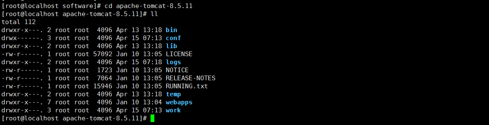
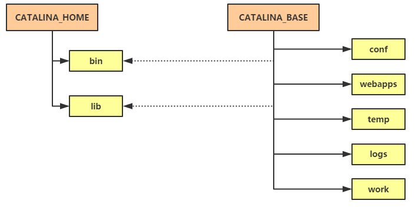
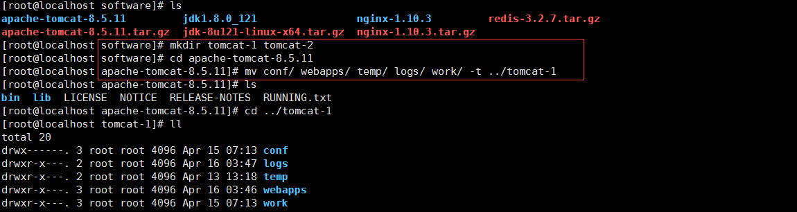
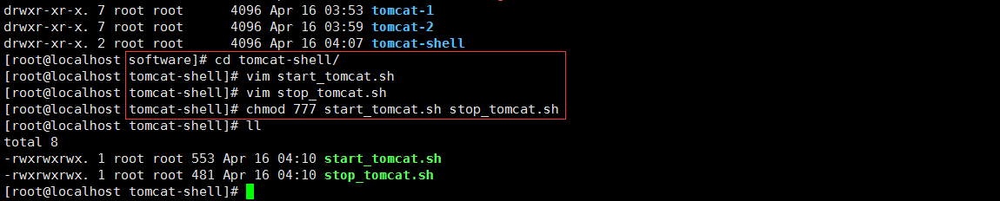
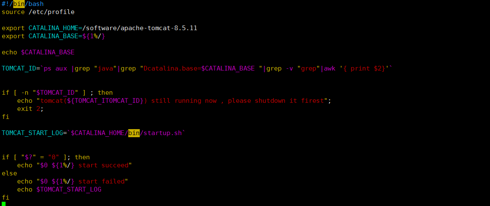
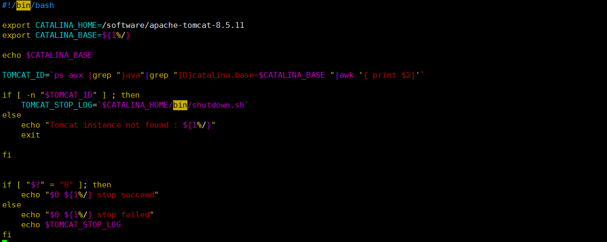
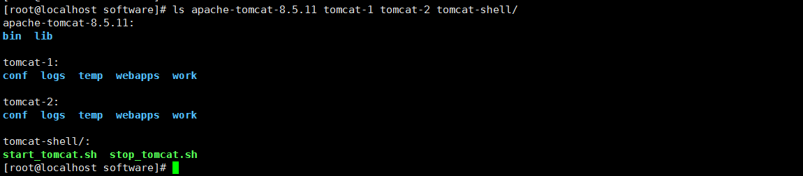
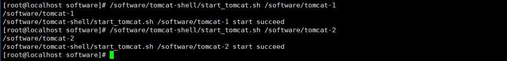
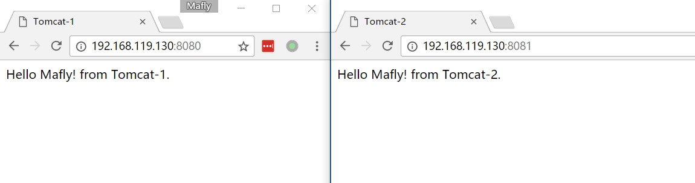

# Tomcat

[TOC]


先说 Tomcat 这一单词解释，如果你不是一个开发者，当然它在美国口语中并非是褒义词；如果你是开发者，那你一定听过 Web 应用服务器、Sun 公司和 Tomcat 。如你所知道那样，牛逼的公司总是推动这个世界的发展，并建立一个又一个标准，当然，在软件界 Sun 公司绝对算牛逼中的其一。
在贵的离谱的商用服务器充斥着市场的时候，Sun 公司推出了第一个 Java servlet container(Servlet 容器) 名字叫：Java Web Server(JWS)，物美价廉，这简直是业界的一股清流，但市场并没有像他们想象的那么喜欢 JWS，一家商业公司如果产品卖不出去，那真是令人极其伤感的，但对于 Sun 公司来说这不重要，因为他们是 Java servlet 这个最初的标准的制定者，应该没有什么比这个更令人兴奋的了。随着标准的推出，直接推动了当时许多自由的、免费的 Java servlet container 的出现，像 Jetty 、JServ 等这些容器，好像所有人都喜欢免费，当然同时期还有一些商用的如 WebLogic 、JRun 这些容器存在。到这里好像还并没有出现 Tomcat ，别着急，Sun 公司其实比你更着急，因为 JSP 还没有出现。
可能由于 Sun 公司在 Servlet 容器市场的低迷表现，他们转头又愤而推出了迷你型 servlet coutainer 并支持 Web 的工具包，他们称之为 JavaServer Pages(JSP)，这个工具包（JSDK）任何人都可以下载，接着随着 Sun 接着制定了新版的 JSP 规范，JSDK 也升级到了 2.1 版本后，注意，这时候大神出现了。在 Sun 公司上班的 James Duncan Davidson 没有使用任何原来代码的情况下写出了一个全新的 servlet contaniner ，从此取代了 JSDK 2.1 版本，因次这也是为什么 Tomcat 的版本是从 3.0 开始的而不是 1.0 。
当然，接下来的加入 Apache 基金会和开源也算是 Sun 公司为软件界的贡献，这其中肯定有商业上的考虑，但你何必在意呢。

## Tomcat 的基本组成

了解一个事物的本质是现在就用它。不废话，直接先说一下 Tomcat 的安装和使用，之前写过 Tomcat 在 CentOS 、Windows 和配合 Nginx 在做负载均衡这三篇文章，用到的可以简单看下：

- [CentOS 下安装 Tomcat](http://blog.mayongfa.cn/82.html)
- [Windows 下安装 Tomcat](http://blog.mayongfa.cn/81.html)
- [CentOS 下 Nginx + Tomcat 配置负载均衡](http://blog.mayongfa.cn/84.html)

安装好之后，进入安装目录看一眼结构：



简单介绍一下各个文件夹及文件：

- **bin**：主要存放脚本文件，例如比较常用的windows和linux系统中启动和关闭脚本
- **conf**：主要存放配置文件，其中最重要的两个配置文件是**server.xml和web.xml**
- **lib**：主要存放tomcat运行所依赖的包
- LICENSE：版权许可证，软件版权信息及使用范围等信息
- **logs**：主要存放运行时产生的日志文件，例如catalina.out(曾经掉过一个大坑)、catalina.{date}.log等
- NOTICE：通知信息，一些软件的所属信息和地址什么的
- RELEASE-NOTES：发布说明，包含一些版本升级功能点
- RUNNING.txt：运行说明，必需的运行环境等信息
- **temp**：存放tomcat运行时产生的临时文件，例如开启了hibernate缓存的应用程序，会在该目录下生成一些文件
- **webapps**：部署web应用程序的默认目录，也就是 war 包所在默认目录
- **work**：主要存放由JSP文件生成的servlet（java文件以及最终编译生成的class文件）

上面是一个安装后的 Tomcat 的全部组成部分，如果你要启动，进入`bin`目录执行`startup.sh`就可以了，接着就可以在浏览器输入`http://localhost:8080/`访问了。那么问题来了：**当你有了三个、五个以及十个应用服务需要同时部署到同一台服务器上时，你的 Tomcat 服务正确启动方式是什么？**是把上面文件全部复制出 N 多个目录么？还是有其他处理方式呢？

## Tomcat 常见的几种部署场景

通常，我们在同一台服务器上对 Tomcat 部署需求可以分为以下几种：单实例单应用，单实例多应用，多实例单应用，多实例多应用。实例的概念可以理解为上面说的一个 Tomcat 目录。

- **单实例单应用**：比较常用的一种方式，只需要把你打好的 war 包丢在 `webapps`目录下，执行启动 Tomcat 的脚本就行了。
- **单实例多应用**：有两个不同的 Web 项目 war 包，还是只需要丢在`webapps`目录下，执行启动 Tomcat 的脚本，访问不同项目加上不同的虚拟目录。这种方式要慎用在生产环境，因为重启或挂掉 Tomcat 后会影响另外一个应用的访问。
- **多实例单应用**：多个 Tomcat 部署同一个项目，端口号不同，可以利用 Nginx 这么做负载均衡，当然意义不大。
- **多实例多应用**：多个 Tomcat 部署多个不同的项目。这种模式在服务器资源有限，或者对服务器要求并不是很高的情况下，可以实现多个不同项目部署在同一台服务器上的需求，来实现资源使用的最大化。-

这次其实要说的就是这种方式，但多个 Tomcat 就是简单的复制出一个新的 Tomcat 目录后改一下端口么？这样做也太 Low 了点吧？哈哈，其实并不是低端没技术含量的问题，当你同一台服务器部署了多个不同基于 Tomcat 的 Web 服务时，会迎来下面几个极其现实的问题。

- 当你需要对数十台 Tomcat 版本进行升级的时候，你需要怎么做？
- 当你需要针对每一个不同的 Web 服务分配不用的内存时，你需要怎么做？
- 当你需要启动多台服务器时，你需要怎么做？

当然，好像上面的都不是很重要，注意，划重点，多实例部署最大作用就是最大化利用服务器资源。

## 说干就干，现在就开始干？

别着急别着急，先看一下官方文档怎么建议的。他们说可不建议你复制一个又一份的全部 Tomcat 目录进行多实例的部署，说安照下图可以实现更优雅的 Tomcat 单机多实例部署：



上图中的 `CATALINA_HOME` 指Tomcat安装路径，`CATALINA_BASE` 指实例所在位置。
`CATALINA_HOME` 路径下只需要包含 `bin` 和 `lib` 目录，而 `CATALINA_BASE` 只存放 `conf、webapps、logs` 等这些文件，这样部署的好处在于升级方便，配置及安装文件间互不影响，在不影响 Tomcat 实例的前提下，替换掉 `CATALINA_HOME` 中的安装文件。

流程清楚了，接下来才是真正的撸起袖子加油干了。

## 快来实践一下吧

你看到了这里肯定已经安装了 Tomcat 了，我现在演示用的是最新的 8.5.11 版本。

**1.复制出两个 Tomcat 实例**
在 Tomcat 安装路径的同一级目录下，新建两个`tomcat-1、tomcat-2`文件夹，先把安装路径下的 `conf、webapps、temp、logs、work` 这五个文件移动到`tomcat-1`实例中：


命令：

```
mkdir tomcat-1 tomcat-2
cd apache-tomcat-8.5.11
mv conf/ webapps/ temp/ logs/ work/ -t ../tomcat-1
```

接着把`tomcat-1`下的这几个文件再复制到`tomcat-2`中，直接命令：

```
cp tomcat-1/* tomcat-2
```

**2.新建 Tomcat 启动、停止脚本**
依然是在 Tomcat 安装路径的同一级目录下，新建两个`tomcat-shell`文件夹，用于存放启动和停止脚本，同时赋予文件全部权限。


命令：

```
cd tomcat-shell/
vim start_tomcat.sh
vim stop_tomcat.sh
chmod 777 start_tomcat.sh stop_tomcat.sh
```

tomcat-start.sh：


```
#!/bin/bash

export CATALINA_HOME=/software/apache-tomcat-8.5.11
export CATALINA_BASE=${1%/}

echo $CATALINA_BASE

TOMCAT_ID=`ps aux |grep "java"|grep "Dcatalina.base=$CATALINA_BASE "|grep -v "grep"|awk '{ print $2}'`


if [ -n "$TOMCAT_ID" ] ; then
echo "tomcat(${TOMCAT_ITOMCAT_ID}) still running now , please shutdown it firest";
    exit 2;
fi

TOMCAT_START_LOG=`$CATALINA_HOME/bin/startup.sh`


if [ "$?" = "0" ]; then
    echo "$0 ${1%/} start succeed"
else
    echo "$0 ${1%/} start failed"
    echo $TOMCAT_START_LOG
fi
```

tomcat-stop.sh：


```
#!/bin/bash

export CATALINA_HOME=/software/apache-tomcat-8.5.11
export CATALINA_BASE=${1%/}

echo $CATALINA_BASE

TOMCAT_ID=`ps aux |grep "java"|grep "[D]catalina.base=$CATALINA_BASE "|awk '{ print $2}'`

if [ -n "$TOMCAT_ID" ] ; then
TOMCAT_STOP_LOG=`$CATALINA_HOME/bin/shutdown.sh`
else
    echo "Tomcat instance not found : ${1%/}"
    exit

fi


if [ "$?" = "0" ]; then
    echo "$0 ${1%/} stop succeed"
else
    echo "$0 ${1%/} stop failed"
    echo $TOMCAT_STOP_LOG
fi
```

这两个就是简单的脚本，其中传入了要启动的 Tomcat 实例所在的路径，当然，你也可以写一个重启的脚本，其实就是先停止再启动，还可以加入不同的 JVM 参数配置等等操作。
到这里，其实全部基础工作已经做好了。接下来我们看一眼整个多实例的目录结构：



**3.配置 server.xml 端口**
你知道的，同一个服务器部署不同 Tomcat 要设置不同的端口，不然会报端口冲突，所以我们只需要修改`conf/server.xml`中的其中前三个端口就行了。但它有四个分别是：

- **Server Port**：该端口用于监听关闭tomcat的shutdown命令，默认为8005
- **Connector Port**：该端口用于监听HTTP的请求，默认为8080
- **AJP Port**：该端口用于监听AJP（ Apache JServ Protocol ）协议上的请求，通常用于整合Apache Server等其他HTTP服务器，默认为8009
- Redirect Port：重定向端口，出现在Connector配置中，如果该Connector仅支持非SSL的普通http请求，那么该端口会把 https 的请求转发到这个Redirect Port指定的端口，默认为8443；

我这里把 `tomcat-2` 实例的 `Connector Port` 改为了 8081 ，并分别在 `tomcat-1、tomcat-2` 的 `webapps/ROOT` 目录下放入了一个页面文件，内容如下：

```
<html>
<title>Tomcat-1</title>
<body>
    Hello Mafly! from Tomcat-1.
</body>
</html>
```

**4.启动**
直接通过执行我们刚写的脚本，传入某一个 Tomcat 实例路径即可来启动对应的 Tomcat。


命令：

```
/software/tomcat-shell/start_tomcat.sh /software/tomcat-1
/software/tomcat-shell/start_tomcat.sh /software/tomcat-2
```

去浏览器看一眼：


哈哈，可以了。接下来，停止或者重启什么的都一样，你可以根据需要来在单个服务器上创建更多的 Tomcat 实例，一切都看你喜欢。

## [总结一下](http://blog.mayongfa.cn/)

这两天简单翻了一下 《Tomcat 权威指南》这本书，对于我们日常使用的 Tomcat 有了更详细的了解，当然我在这里并没有详细写配置、部署管理工具、安全管理和集群什么的，我还了解不够透彻，只是简单把 Tomcat 单机多实例比较优雅的部署方式玩了一下，希望对你有用。

昨天晚上看 Linux 和 Git 的发起者 Linus 这位大神的传记，真是令人感到上帝的不公平，怎么能设计出这样的天才人类，但更令人兴奋的是，我们目前绝大多数人都被设计成了几乎无差别，还远远轮不到拼智商的地步。


# 坑

1、使用tomcat的时候在webapps目录下会根据目录结构创建对应的url链接，其他目录例如包含WEB-INF以及META-INF的文件夹`idevcloudwebsub2`，就需要在url访问的时候添加最高级母后缀http://localhost:8081/idevcloudwebsub2 只有通过这样的方式能够访问 

而创建`ROOT`下的内容就可以直接通过地址访问

2、Tomcat在IDEA中的部署会采用创建临时变量分离`CATALINA_HOME` ，`CATALINA_BASE` 的方式进行其中base指向的是idea创建的临时配置文件，其中会根据GUI中配置的run/debug configuration中的端口以及后缀实现，IDEA与eclipse区别的一点是，eclipse会自动读取application.properties中的服务器配置内容，而idea则通过gui手动实现