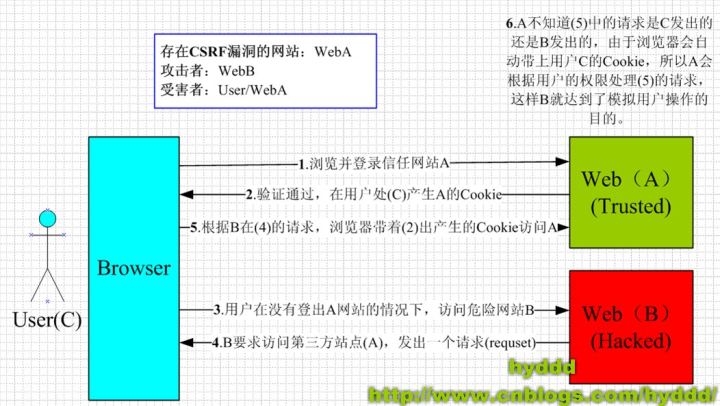
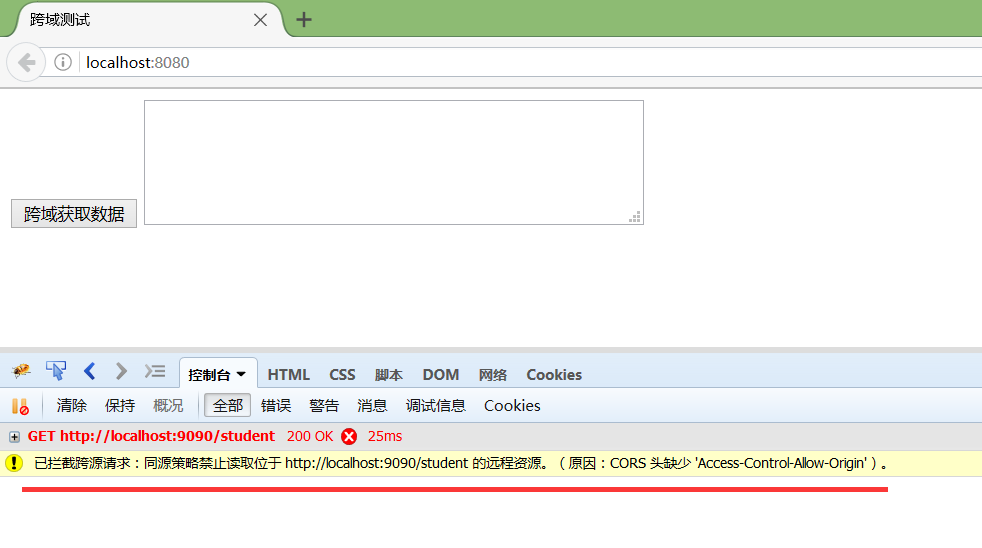
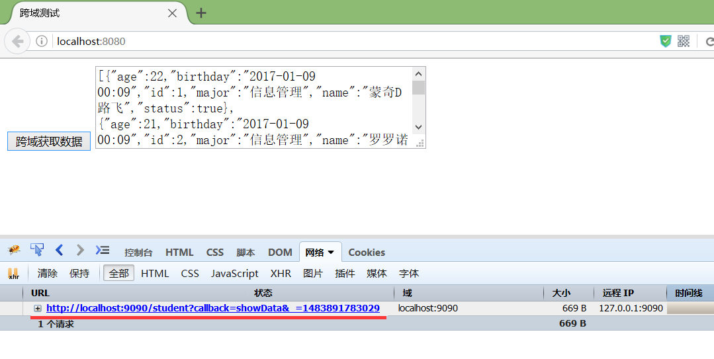
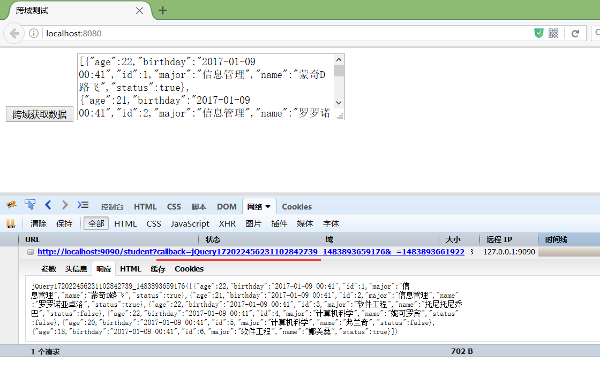

# jQuery


[TOC]


## 跨域请求问题

**什么是跨域？**

跨域，指的是浏览器不能执行其他网站的脚本。它是由浏览器的同源策略造成的，是**浏览器施加的**安全限制。

**所谓同源是指，域名，协议，端口均相同，不明白没关系，举个栗子：**

> **http://www.123.com/index.html 调用 http://www.123.com/server.php （非跨域）**
>
> **http://www.123.com/index.html 调用 http://www.456.com/server.php （主域名不同:123/456，跨域）**
>
> **http://abc.123.com/index.html 调用 http://def.123.com/server.php （子域名不同:abc/def，跨域）**
>
> **http://www.123.com:8080/index.html 调用 http://www.123.com:8081/server.php （端口不同:8080/8081，跨域）**
>
> **http://www.123.com/index.html 调用 https://www.123.com/server.php （协议不同:http/https，跨域）**
>
> **请注意：localhost和127.0.0.1虽然都指向本机，但也属于跨域。**

浏览器执行javascript脚本时，会检查这个脚本属于哪个页面，如果不是同源页面，就不会被执行。

禁止跨域请求的原因是由于中间人通过跨域请求利用本地浏览器访问带cookie的网页时能够模拟用户操作，浏览器默认禁止跨域请求，将浏览器转变成一个只进不出的单向盒，**浏览器不会主动对其他网页发出允许cookie的请求**

 


### 跨域请求错误示范

```html
<%@ page pageEncoding="utf-8" contentType="text/html;charset=UTF-8"  language="java" %>
<html>
<head>
    <title>跨域测试</title>
    <script src="js/jquery-1.7.2.js"></script>
    <script>
        $(document).ready(function () {
            
            $("#btn").click(function () {
                $.ajax({
                    url: 'http://localhost:9090/student',
                    type: 'GET',
                    success: function (data) {
                        $(text).val(data);
                    }
                });

            });
            
        });
    </script>
</head>
<body>
    <input id="btn" type="button" value="跨域获取数据" />
    <textarea id="text" style="width: 400px; height: 100px;"></textarea>
</body>
</html>
```


 

### 允许的跨域请求方式

首先我们需要明白，在页面上直接发起一个跨域的ajax请求是不可以的，但是，在页面上引入不同域上的js脚本却是可以的，就像你可以在自己的页面上使用`` 标签来随意显示某个域上的图片一样。

比如我在8080端口的页面上请求一个9090端口的图片：可以看到直接通过src跨域请求是可以的。

那么看下如何使用`<script src="">`来完成一个跨域请求：

　　当点击"跨域获取数据"的按钮时，添加一个`<script>`标签，用于发起跨域请求；注意看请求地址后面带了一个`callback=showData`的参数；

　　`showData`即是回调函数名称，传到后台，用于包裹数据。数据返回到前端后，就是`showData(result)`的形式，因为是script脚本，所以自动调用`showData`函数，而`result`就是`showData`的参数。

　　至此，我们算是跨域把数据请求回来了，但是比较麻烦，需要自己写脚本发起请求，然后写个回调函数处理数据，不是很方便。

```html
<script>
        //回调函数
        function showData (result) {
            var data = JSON.stringify(result); //json对象转成字符串
            $("#text").val(data);
        }
        $(document).ready(function () {
            $("#btn").click(function () {
                //向头部输入一个脚本，该脚本发起一个跨域请求
                $("head").append("<script src='http://localhost:9090/student?callback=showData'><\/script>");
            });
        });
</script>
```

```java
/*  后端处理将数据包装为浏览器的callback返回  */
protected void doGet(HttpServletRequest request, HttpServletResponse response) throws ServletException, IOException {
    response.setCharacterEncoding("UTF-8");
    response.setContentType("text/html;charset=UTF-8");

    //数据
    List<Student> studentList = getStudentList();


    JSONArray jsonArray = JSONArray.fromObject(studentList);
    String result = jsonArray.toString();

    //前端传过来的回调函数名称
    String callback = request.getParameter("callback");
    //用回调函数名称包裹返回数据，这样，返回数据就作为回调函数的参数传回去了
    result = callback + "(" + result + ")";

    response.getWriter().write(result);
}
```

 

通过回调函数的方式能够实现返回

**1、JSONP**

```html
    <script>
        $(document).ready(function () {
            $("#btn").click(function () {
                $.ajax({
                    url: "http://localhost:9090/student",
                    type: "GET",
                    dataType: "jsonp", //指定服务器返回的数据类型
                    success: function (data) {
                        var result = JSON.stringify(data); //json对象转成字符串
                        $("#text").val(result);
                    }
                });
            });
        });
    </script>
```

但是要注意JSONP只支持GET请求，不支持POST请求。

 

`callback=showData`；调用回调函数的时候，先调用了指定的`showData`，然后再调用了`success`。所以，`success`是返回成功后必定会调用的函数，就看你怎么写了。 


#### **2、代理**

例如www.123.com/index.html需要调用www.456.com/server.php，可以写一个接口www.123.com/server.php，由这个接口在后端去调用www.456.com/server.php并拿到返回值，然后再返回给index.html，这就是一个代理的模式。相当于绕过了浏览器端，自然就不存在跨域问题。

#### **3、PHP端修改header（XHR2方式）**

在php接口脚本中加入以下两句即可：

header('Access-Control-Allow-Origin:*');//允许所有来源访问

header('Access-Control-Allow-Method:POST,GET');//允许访问的方式


## **四种常见的POST提交数据方式**

- application/x-www-form-urlencoded （默认）
- multipart/form-data
- **application/json**
- text/xml

**application/x-www-form-urlencoded** 
很多时候，我们用 Ajax 提交数据时，也是使用这种方式。例如 JQuery 和 QWrap 的 Ajax，Content-Type 默认值都是「application/x-www-form-urlencoded;charset=utf-8」。 
**multipart/form-data** 
主要用于上传文件

```
POST http://www.example.com HTTP/1.1
Content-Type:multipart/form-data; boundary=----WebKitFormBoundaryrGKCBY7qhFd3TrwA

------WebKitFormBoundaryrGKCBY7qhFd3TrwA
Content-Disposition: form-data; name="text"

title
------WebKitFormBoundaryrGKCBY7qhFd3TrwA
Content-Disposition: form-data; name="file"; filename="chrome.png"
Content-Type: image/png

PNG ... content of chrome.png ...
------WebKitFormBoundaryrGKCBY7qhFd3TrwA--12345678910111213
```

首先生成了一个 boundary 用于分割不同的字段，为了避免与正文内容重复，boundary 很长很复杂。然后 Content-Type 里指明了数据是以 multipart/form-data 来编码，本次请求的 boundary 是什么内容。消息主体里按照字段个数又分为多个结构类似的部分，每部分都是以 –boundary 开始，紧接着是内容描述信息，然后是回车，最后是字段具体内容（文本或二进制）。如果传输的是文件，还要包含文件名和文件类型信息。消息主体最后以 –boundary– 标示结束。

**application/json** 
用来告诉服务端消息主体是序列化后的 JSON 字符串。由于 JSON 规范的流行，除了低版本 IE 之外的各大浏览器都原生支持 JSON.stringify，服务端语言也都有处理 JSON 的函数，使用 JSON 不会遇上什么麻烦。 
JSON 格式支持比键值对复杂得多的结构化数据，这一点也很有用。

```
POST http://www.example.com HTTP/1.1 
Content-Type: application/json;charset=utf-8

{"title":"test","sub":[1,2,3]}
```

这种方案，可以方便的提交复杂的结构化数据，特别适合 RESTful 的接口。各大抓包工具如 Chrome 自带的开发者工具、Firebug、Fiddler，都会以树形结构展示 JSON 数据，非常友好。但也有些服务端语言还没有支持这种方式，例如 php 就无法通过 $_POST 对象从上面的请求中获得内容。这时候，需要自己动手处理下：在请求头中 Content-Type 为 application/json 时，从 php://input 里获得原始输入流，再 json_decode 成对象。一些 php 框架已经开始这么做了。

当然 AngularJS 也可以配置为使用 x-www-form-urlencoded 方式提交数据。如有需要，可以参考这篇文章。

转自：[四种POST 提交数据方式](https://imququ.com/post/four-ways-to-post-data-in-http.html)

**关于 text/xml**

典型的 XML-RPC 请求是这样的：

```
  POST http://www.example.com HTTP/1.1 
Content-Type: text/xml
<?xml version="1.0"?>
<methodCall>
    <methodName>examples.getStateName</methodName>
    <params>
        <param>
            <value><i4>41</i4></value>
        </param>
    </params>
</methodCall>
```

XML-RPC 协议简单、功能够用，各种语言的实现都有。它的使用也很广泛，如 WordPress 的 XML-RPC Api，搜索引擎的 ping 服务等等。JavaScript 中，也有现成的库支持以这种方式进行数据交互，能很好的支持已有的 XML-RPC 服务。不过，我个人觉得 XML 结构还是过于臃肿，一般场景用 JSON 会更灵活方便。

服务器端使用xmlrpc_server_create函数产生一个服务器端

PHP中集成了XML-RPC和SOAP两种协议的访问，都是集中在xmlrpc扩展当中。而且该扩展跟xmlrpc扩展无关，能够独立实现XML-RPC的协议交互，如果没有xmlrpc扩展，建议使用PEAR::XML-RPC扩展。


jsonp封装

