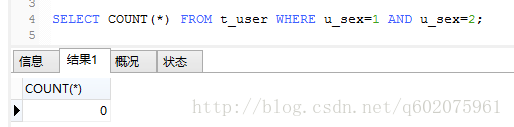
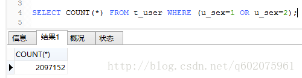
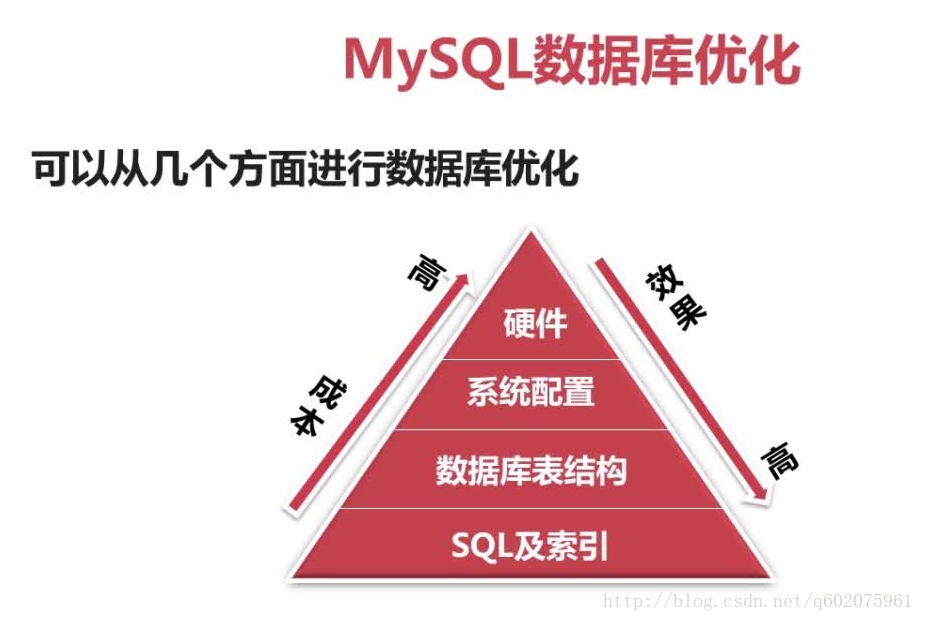
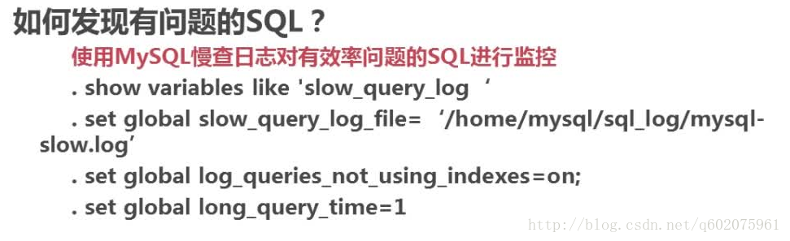
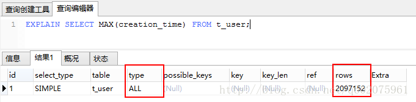
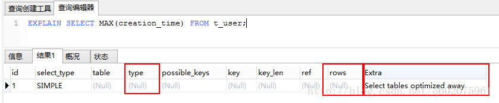
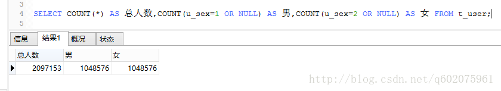
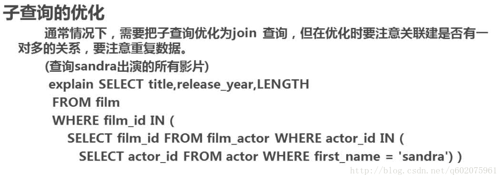

# DataBase

[TOC]


## 数据库优化指南

#### 1、选取最适用的字段属性

MySQL可以很好的支持大数据量的存取，但是一般说来，数据库中的表越小，在它上面执行的查询也就会越快。因此，在创建表的时候，为了获得更好的性能，我们可以将表中字段的宽度设得尽可能小。

例如，在定义邮政编码这个字段时，如果将其设置为CHAR(255),显然给数据库增加了不必要的空间，甚至使用VARCHAR这种类型也是多余的，因为CHAR(6)就可以很好的完成任务了。同样的，如果可以的话，我们应该使用MEDIUMINT而不是BIGIN来定义整型字段。

**另外一个提高效率的方法是在可能的情况下，应该尽量把字段设置为NOTNULL**，这样在将来执行查询的时候，数据库不用去比较NULL值。
对于某些文本字段，例如“省份”或者“性别”，我们可以将它们定义为ENUM类型。因为在MySQL中，ENUM类型被当作数值型数据来处理，而数值型数据被处理起来的速度要比文本类型快得多。这样，我们又可以提高数据库的性能。

#### 2、使用连接（JOIN）来代替子查询(Sub-Queries)

MySQL从4.1开始支持SQL的子查询。这个技术可以使用SELECT语句来创建一个单列的查询结果，然后把这个结果作为过滤条件用在另一个查询中。例如，我们要将客户基本信息表中没有任何订单的客户删除掉，就可以利用子查询先从销售信息表中将所有发出订单的客户ID取出来，然后将结果传递给主查询，如下所示：

`DELETE FROM customerinfo`

`WHERE CustomerID NOT IN (SELECT CustomerID FROM salesinfo)`

使用子查询可以一次性的完成很多逻辑上需要多个步骤才能完成的SQL操作，同时也可以避免事务或者表锁死，并且写起来也很容易。但是，有些情况下，子查询可以被更有效率的连接（JOIN）..替代。例如，假设我们要将所有没有订单记录的用户取出来，可以用下面这个查询完成：

`SELECT * FROM customerinfo`

`WHERE CustomerID NOT IN (SELECTC ustomerID FROM salesinfo)`

**如果使用连接（JOIN）..来完成这个查询工作，速度将会快很多**。尤其是当salesinfo表中对CustomerID建有索引的话，性能将会更好，查询如下：

`SELECT * FROM customerinfo`

`LEFT JOIN salesinfo ON customerinfo.CustomerID=salesinfo.CustomerID`

`WHERE salesinfo.CustomerID ISNULL`

连接（JOIN）..之所以更有效率一些，是因为MySQL不需要在内存中创建临时表来完成这个逻辑上的需要两个步骤的查询工作。

#### 3、使用联合(UNION)来代替手动创建的临时表

MySQL从4.0的版本开始支持union查询，它可以把需要使用临时表的两条或更多的select查询合并的一个查询中。在客户端的查询会话结束的时候，临时表会被自动删除，从而保证数据库整齐、高效。使用union来创建查询的时候，我们只需要用UNION作为关键字把多个select语句连接起来就可以了，要注意的是所有select语句中的字段数目要想同。下面的例子就演示了一个使用UNION的查询。

`SELECT Name,Phone FROM client UNION`

`SELECT Name,BirthDate FROM author UNION`

`SELECT Name,Supplier FROM product`

#### 4、事务

尽管我们可以使用子查询（Sub-Queries）、连接（JOIN）和联合（UNION）来创建各种各样的查询，但不是所有的数据库操作都可以只用一条或少数几条SQL语句就可以完成的。更多的时候是需要用到一系列的语句来完成某种工作。但是在这种情况下，当这个语句块中的某一条语句运行出错的时候，整个语句块的操作就会变得不确定起来。设想一下，要把某个数据同时插入两个相关联的表中，可能会出现这样的情况：第一个表中成功更新后，数据库突然出现意外状况，造成第二个表中的操作没有完成，这样，就会造成数据的不完整，甚至会破坏数据库中的数据。要避免这种情况，就应该使用事务，它的作用是：要么语句块中每条语句都操作成功，要么都失败。换句话说，就是可以保持数据库中数据的一致性和完整性。事物以BEGIN关键字开始，COMMIT关键字结束。在这之间的一条SQL操作失败，那么，ROLLBACK命令就可以把数据库恢复到BEGIN开始之前的状态。

`BEGIN; INSERT INTO salesinfo SET CustomerID=14; UPDATE inventory SET Quantity=11 WHERE item='book'; COMMIT;`

事务的另一个重要作用是当多个用户同时使用相同的数据源时，它可以利用锁定数据库的方法来为用户提供一种安全的访问方式，这样可以保证用户的操作不被其它的用户所干扰。

#### 5、锁定表

尽管事务是维护数据库完整性的一个非常好的方法，但却因为它的独占性，有时会影响数据库的性能，尤其是在很大的应用系统中。由于在事务执行的过程中，数据库将会被锁定，因此其它的用户请求只能暂时等待直到该事务结束。如果一个数据库系统只有少数几个用户来使用，事务造成的影响不会成为一个太大的问题；但假设有成千上万的用户同时访问一个数据库系统，例如访问一个电子商务网站，就会产生比较严重的响应延迟。

其实，有些情况下我们可以通过锁定表的方法来获得更好的性能。下面的例子就用锁定表的方法来完成前面一个例子中事务的功能。

`LOCK TABLE inventory WRITE SELECT Quantity FROM inventory WHERE Item='book';`

`...`

`UPDATE inventory SET Quantity=11 WHERE Item='book'; UNLOCKTABLES`

这里，我们用一个select语句取出初始数据，通过一些计算，用update语句将新值更新到表中。包含有WRITE关键字的LOCKTABLE语句可以保证在UNLOCKTABLES命令被执行之前，不会有其它的访问来对inventory进行插入、更新或者删除的操作。

#### 6、使用外键

**锁定表的方法可以维护数据的完整性，但是它却不能保证数据的关联性。这个时候我们就可以使用外键。**

例如，外键可以保证每一条销售记录都指向某一个存在的客户。在这里，外键可以把customerinfo表中的CustomerID映射到salesinfo表中CustomerID，任何一条没有合法CustomerID的记录都不会被更新或插入到salesinfo中。

```
CREATE    TABLE    customerinfo( CustomerIDINT    NOT    NULL,PRIMARYKEY(CustomerID))TYPE=INNODB;

CREATE    TABLE    salesinfo( SalesIDNT    NOT    NULL,CustomerIDINT    NOT    NULL,

PRIMARYKEY(CustomerID,SalesID),

FOREIGNKEY(CustomerID)    REFERENCES    customerinfo(CustomerID)    ON    DELETE    CASCADE)TYPE=INNODB;
```

注意例子中的参数“ON DELETE CASCADE”。该参数保证当customerinfo表中的一条客户记录被删除的时候，salesinfo表中所有与该客户相关的记录也会被自动删除。如果要在MySQL中使用外键，一定要记住在创建表的时候将表的类型定义为事务安全表InnoDB类型。该类型不是MySQL表的默认类型。定义的方法是在CREATETABLE语句中加上TYPE=INNODB。如例中所示。

#### 7、使用索引

索引是提高数据库性能的常用方法，它可以令数据库服务器以比没有索引快得多的速度检索特定的行，尤其是在查询语句当中包含有MAX(),MIN()和ORDERBY这些命令的时候，性能提高更为明显。

那该对哪些字段建立索引呢？

一般说来，索引应建立在那些将用于JOIN,WHERE判断和ORDERBY排序的字段上。尽量不要对数据库中某个含有大量重复的值的字段建立索引。对于一个ENUM类型的字段来说，出现大量重复值是很有可能的情况

例如customerinfo中的“province”..字段，在这样的字段上建立索引将不会有什么帮助；相反，还有可能降低数据库的性能。我们在创建表的时候可以同时创建合适的索引，也可以使用ALTERTABLE或CREATEINDEX在以后创建索引。此外，MySQL从版本3.23.23开始支持全文索引和搜索。全文索引在MySQL中是一个FULLTEXT类型索引，但仅能用于MyISAM类型的表。对于一个大的数据库，将数据装载到一个没有FULLTEXT索引的表中，然后再使用ALTERTABLE或CREATEINDEX创建索引，将是非常快的。但如果将数据装载到一个已经有FULLTEXT索引的表中，执行过程将会非常慢。

#### 8、优化的查询语句

绝大多数情况下，使用索引可以提高查询的速度，但如果SQL语句使用不恰当的话，索引将无法发挥它应有的作用。

下面是应该注意的几个方面。

- 首先，最好是在相同类型的字段间进行比较的操作。

  > 在MySQL3.23版之前，这甚至是一个必须的条件。例如不能将一个建有索引的INT字段和BIGINT字段进行比较；但是作为特殊的情况，在CHAR类型的字段和VARCHAR类型字段的字段大小相同的时候，可以将它们进行比较。

- 其次，在建有索引的字段上尽量不要使用函数进行操作。

> 例如，在一个DATE类型的字段上使用YEAE()函数时，将会使索引不能发挥应有的作用。所以，下面的两个查询虽然返回的结果一样，但后者要比前者快得多。

- 第三，在搜索字符型字段时，我们有时会使用LIKE关键字和通配符，这种做法虽然简单，但却也是以牺牲系统性能为代价的。

例如下面的查询将会比较表中的每一条记录。

```
SELECT    *    FROM    books

WHERE    name    like"MySQL%"
```

但是如果换用下面的查询，返回的结果一样，但速度就要快上很多：

```
SELECT    *    FROM    books

WHERE    name＞="MySQL"    andname    ＜"MySQM"
```

最后，应该注意避免在查询中让MySQL进行自动类型转换，因为转换过程也会使索引变得不起作用。


### 优化二

**1. 利用表分区**
分区将数据在物理上分隔开，不同分区的数据可以制定保存在处于不同磁盘上的数据文件里。这样，当对这个表进行查询时，只需要在表分区中进行扫描，而不必进行全表扫描，明显缩短了查询时间，另外处于不同磁盘的分区也将对这个表的数据传输分散在不同的磁盘I/O，一个精心设置的分区可以将数据传输对磁盘I/O竞争均匀地分散开。对数据量大的时时表可采取此方法。可按月自动建表分区。

**2. 别名的使用** 
别名是大型数据库的应用技巧，就是表名、列名在查询中以一个字母为别名，查询速度要比建连接表快1.5倍。 

**3. 索引Index的优化设计**索引可以大大加快数据库的查询速度。但是并不是所有的表都需要建立索引，只针对大数据量的表建立索引就好。
**缺点：**1.创建索引和维护索引要耗费时间，这种时间随着数据量的增加而增加。
2.索引需要占物理空间，除了数据表占数据空间之外，每一个索引还要占一定的物理空间，如果要建立聚簇索引，那么需要的空间就会更大。
3.当对表中的数据进行增加、删除和修改的时候，索引也要动态的维护，这样就降低了数据的维护速度。
索引需要维护：为了维护系统性能，索引在创建之后，由于频繁地对数据进行增加、删除、修改等操作使得索引页发生碎块，因此，必须对索引进行维护。
\4. 物化视图（索引视图） 

一般的视图是虚拟的，而物化视图是实实在在的数据区域，是要占据存储空间的，另外系统刷新物化视图也需要耗费一定的资源，但是它却换来了效率和灵活性。
索引视图更适合在OLAP（读取较多，更新较少）的数据库中使用，不适合在OLTP（记录即时的增、删、改、查）的数据库中使用 。 

**物化视图的注意事项：** 
1.对于复杂而高消耗的查询，如果使用频繁，应建成物化视图。 
2.物化视图是一种典型的以空间换时间的性能优化方式。 
3.对于更新频繁的表慎用物化视图。 
4.选择合适的刷新方式。 

**普通视图和物化视图的区别：**普通视图和物化视图根本就不是一个东西，普通视图是不存储任何数据的，在查询中是转换为对应定义的SQL去查询，而物化视图是将数据转换为一个表，实际存储着数据，这样查询数据，就不用关联一大堆表，如果表很大的话，会在临时表空间内做大量的操作。 
**普通视图的三个特征：** **1）.简化设计，方便，清晰编码**。视图并不是提高性能的，它的存在只会降低性能（例如我们关联两个视图，一个视图关联6个表，另一个视图关联7个表）。 
**2）.安全**，在授权给其他用户或者查看角度，多个表关联只允许查看，不允许修改。
3.从不同的角度看不同的维度，视图可以划分维度和权限，并使多个维度的综合，也就是你要什么就可以从不同的角度看，而表是一个实体的而已，一般维度较少。 

**5. 死锁与阻塞** 
1）.对于需要频繁更新的数据，尽量避免放在长事务中，以免导致连锁反应。 
2）.不是迫不得已，最好不要在数据库锁机制外再加自己设计的锁。 
3）.减少事务大小，及时提交事务。 
4）.尽量避免跨数据库的分布式事务，因为环境的复杂性，很容易导致阻塞。
5）.慎用位图索引，更新时容易导致死锁。 

**6.减少IO与网络传输次数** 1）.尽量用较少的数据库请求，获取到需要的数据，能一次性取出的不分多次取出。 
2）.对于频繁操作数据库的批量操作，应采用存储过程，减少不必要的网络传输。





**2、项目中，优化mysql之前，首先要开启慢查询日志，在分析慢查询日志.**

> 

> 1,查看所有日志状态： show variables like '%quer%';
> 2,查看慢查询状态：show variables like 'show%'

> [linux](http://www.111cn.net/list-156/)启用MySQL慢查询
>
> | 代码如下                                                     |      |
> | ------------------------------------------------------------ | ---- |
> | vim /etc/my.cnf [mysqld] slow-query-log = on # 开启慢查询功能 slow_query_log_file = /usr/local/mysql/data/slow-query.log # 慢查询日志存放路径与名称 long_query_time = 5 # 查询时间超过5s的查询语句 log-queries-not-using-indexes = on # 列出没有使用索引的查询语句 |      |

> Windows下开启MySQL慢查询
>
> MySQL在Windows系统中的配置文件一般是是my.ini找到[mysqld]下面加上
>
> 补充：
>
> 在my.cnf或者my.ini中添加log-queries-not-using-indexes参数，表示记录下没有使用索引的查询。比如：
>
> | 代码如下                                                     |      |
> | ------------------------------------------------------------ | ---- |
> | log-slow-queries=/data/mysqldata/slowquery.log # 慢查询日志存放路径与名称 long_query_time=5 # 查询时间超过5s的查询语句 log-queries-not-using-indexes # 列出没有使用索引的查询语句 |      |




**3、如何分析sql查询**

explain返回各列的含义

extra列需要注意的返回值

Using filesort:看到这个的时候，查询就需要优化了。MYSQL需要进行额外的步骤来发现如何对返回的行排序。它根据连接类型以及存储排序键值和匹配条件的全部行的行指针来排序全部行

Using temporary看到这个的时候，查询需要优化了。这里，MYSQL需要创建一个临时表来存储结果，这通常发生在对不同的列集进行ORDER BY上，而不是GROUP BY上

**3.1  MySql内部函数explain（查询sql的执行计划）使用方法以及返回各列的含义**

explain返回各列的含义

table:显示这一行的数据是关于哪张表的

type:这是重要的列，显示连接使用了何种类型。从最好到最差的连接类型为const、eq_reg、ref、range、index 和ALL

possible_keys:显示可能应用在这张表中的索引。如果为空，没有可能的索引。

key:实际使用的索引。如果为NULL,则没有使用索引。

keyjen:使用的索引的长度。在不损失精确性的情况下，长度越短越好

ref:显示索引的哪一列被使用了，如果可能的话，是一个常数

rows: MYSQL认为必须检查的用来返回请求数据的行数

**实例1：mysql函数【max()】，最后一位注册用户的信息**

**进行查询操作，图一是没有加索引，图二是加了索引的，查询出来的type和rows字段也不相同。（参照上图字段段含义）**







**实例2： mysql函数【**count() 】，获取注册用户男女人数

**显然图三不是这个查询方法不是咱们想要的结果，图四和图五也一样，利用count()函数的特性null不统计，得到了我们想要的结果(图六)。**

**图三：**


**图四：**


**图五：**


**图六：**



**3.2 子查询的优化，通常情况下把子查询优化为join查询，但在优化的时候需要注意关联建是否有一对多的关系，要特别注意重复数据** 




